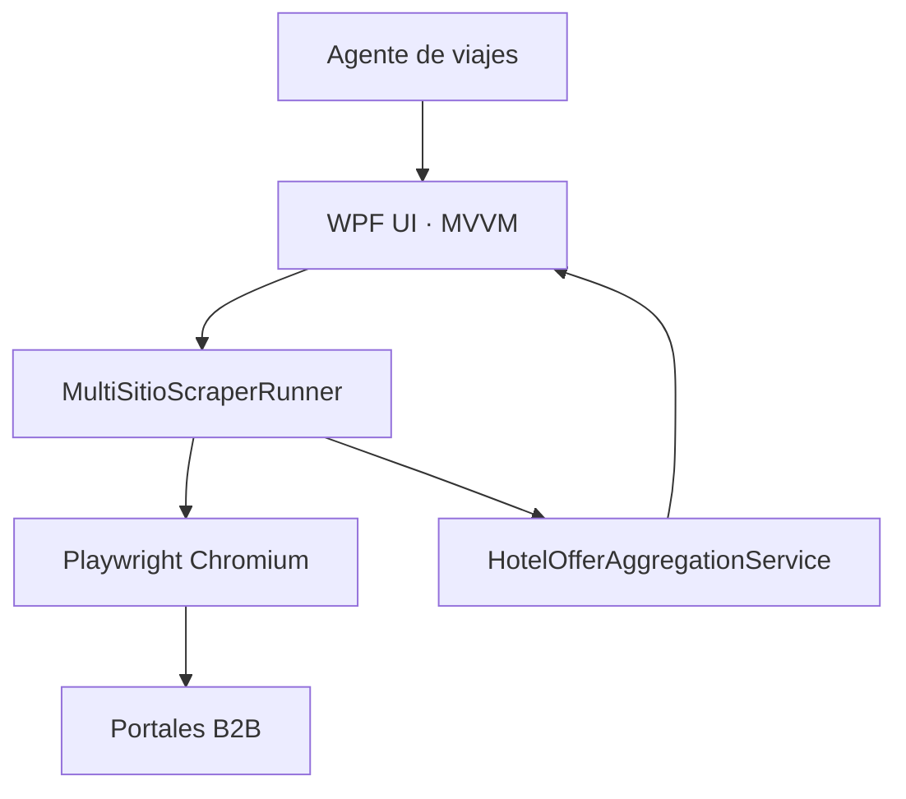
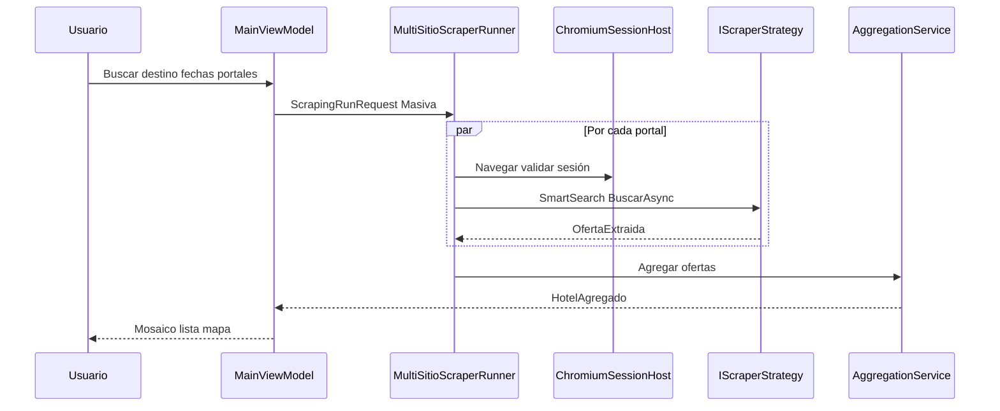

## Resumen ejecutivo

**Holiday Integrator** (`HolidayScraperApp`) resuelve un cuello de botella operativo en agencias de viajes: consultar el **mismo alojamiento** en varios portales mayoristas B2B (BedsOnline, HotelDo, TravelC, PriceAgencies, etc.), cada uno con UI, sesión y nomenclatura propias. La comparación manual es lenta y propensa a error.

La solución automatiza búsquedas con **Playwright (Chromium)**, extrae ofertas estructuradas (`OfertaExtraida`), **correlaciona** ofertas del mismo hotel (`HotelAgregado`) y las presenta en una **UI WPF** (mosaico, lista, mapa WebView2). Como freelance en Holiday Experiences S.A.S., diseño e implemento el motor de **Estancias** de este producto — un proyecto **independiente** de otros trabajos para el mismo cliente (cumplimiento IFX/Zadarma, sync transfronteriza de contratos, etc.).

## Contexto y alcance

| En alcance | Fuera de alcance / parcial |
|------------|----------------------------|
| Servicio **Estancias** (alojamiento) multi-portal | Otros servicios del catálogo (`Parques`, `Vuelos`, …) sin `IScraperStrategy` |
| Búsqueda masiva comparativa | Reserva automática end-to-end |
| Consulta individual + handoff a portal | Sincronización de inventario en tiempo real |
| Comprobación visible desde mosaico (`MosaicVisible`) | Portal genérico plug-and-play sin código por sitio |
| Auto-actualización vía `latest.json` | — |

## Arquitectura

### Contenedores

### Secuencia — búsqueda masiva

<Callout variant="note" title="Prioridad de red">
  Cada interacción que dispare render asíncrono va seguida de un **await de red** explícito. La extracción prioriza **XHR/JSON** (Beds `client-hotel-avail-api`, JSONL HotelDo, partial TravelC) sobre DOM masivo.
</Callout>

## Capacidades clave

### Gestión de portales y sesión

| ID | Capacidad | Estado |
|----|-----------|--------|
| RF-01 | Credenciales por portal cifradas (DPAPI) | ✅ |
| RF-02 | Login interactivo cuando el portal lo exige | ✅ |
| RF-03 | Persistir `storage_state` por `siteKey` | ✅ |
| RF-10 | Búsqueda masiva multi-portal en paralelo | ✅ |
| RF-13 | Extracción priorizando XHR/JSON sobre DOM | ✅ |
| RF-17 | Handoff de reserva: browser abierto en ficha | ✅ |

### Modos de consulta (Estancias)

| Modo | Extracción | Browser | Handoff |
|------|------------|---------|---------|
| **Masiva** | Completa + agregación | Headless (defecto) | No |
| **Individual** | 1 página, sin filtros laterales | Visible | Sí |
| **MosaicVisible** | Omitida; filtros o goto URL | Visible persistente | Browser abierto |

### Portales Estancias

| SiteKey | Estrategia | Extracción principal |
|---------|------------|----------------------|
| BedsOnline | `BedsOnlineScraperStrategy` | DOM + `client-hotel-avail-api` |
| HotelDo | `HotelDoScraperStrategy` | JSONL availability + DOM |
| FullTrips / TravelDepot | `TravelCHotelesSoloAlojamientoScraperStrategy` | PrimeFaces partial/XHR |
| PriceAgencies | `PriceAgenciesScraperStrategy` | API `filter/v2/list` |
| Dream_Vacation_Weak | `DreamVacationWeakScraperStrategy` | Grid certificados |

### Agregación multi-portal

| Criterio | Valor / regla |
|----------|----------------|
| Algoritmo | Union-Find restringido (1 oferta por `SiteKey` por clúster) |
| Similitud de nombre | ≥ **0,88** (TokenSetRatio) |
| Geo cruzada | ≤ **0,7 km** + similitud ≥ **0,45** si geo real en ambas |
| Estrellas | Diferencia ≤ 1 estrella si ambas tienen categoría |

## Decisiones de diseño

| Principio | Implementación |
|-----------|----------------|
| Config-driven por portal | `sitios_config.json` + `IScraperStrategy` por `siteKey` |
| Aislamiento de fallos | Un portal no bloquea a otros (`PlaywrightExtractionCola`) |
| Evidencia barata primero | Trazas XHR/JSONL antes que DOM en `MejoraContinua/` |
| Seguridad local | DPAPI para credenciales; sin telemetría cloud por defecto |
| Operación en Windows | Instalador self-contained .NET 8; WebView2 para mapa |

## Métricas e impacto

<MetricCard value="5+" label="Portales con estrategia Estancias" />
<MetricCard value="3" label="Modos de consulta" />
<MetricCard value="0.88" label="Umbral similitud nombre" />

## Estado y roadmap

- **Activo:** estrategias por portal, SmartSearch, políticas de extracción (`IEstanciasExtractionPolicy`)
- **Despliegue:** Inno Setup + Action1 + manifiesto `latest.json` firmado SHA256
- **Pendiente:** madurez HTTP híbrido por portal (perfil de red → `HttpClient` donde JSON sea estable)
- **Pendiente:** portales adicionales del catálogo sin estrategia real (`NoOpScraperStrategy`)

## Galería

<ProjectGallery slug="holiday-portal" />
