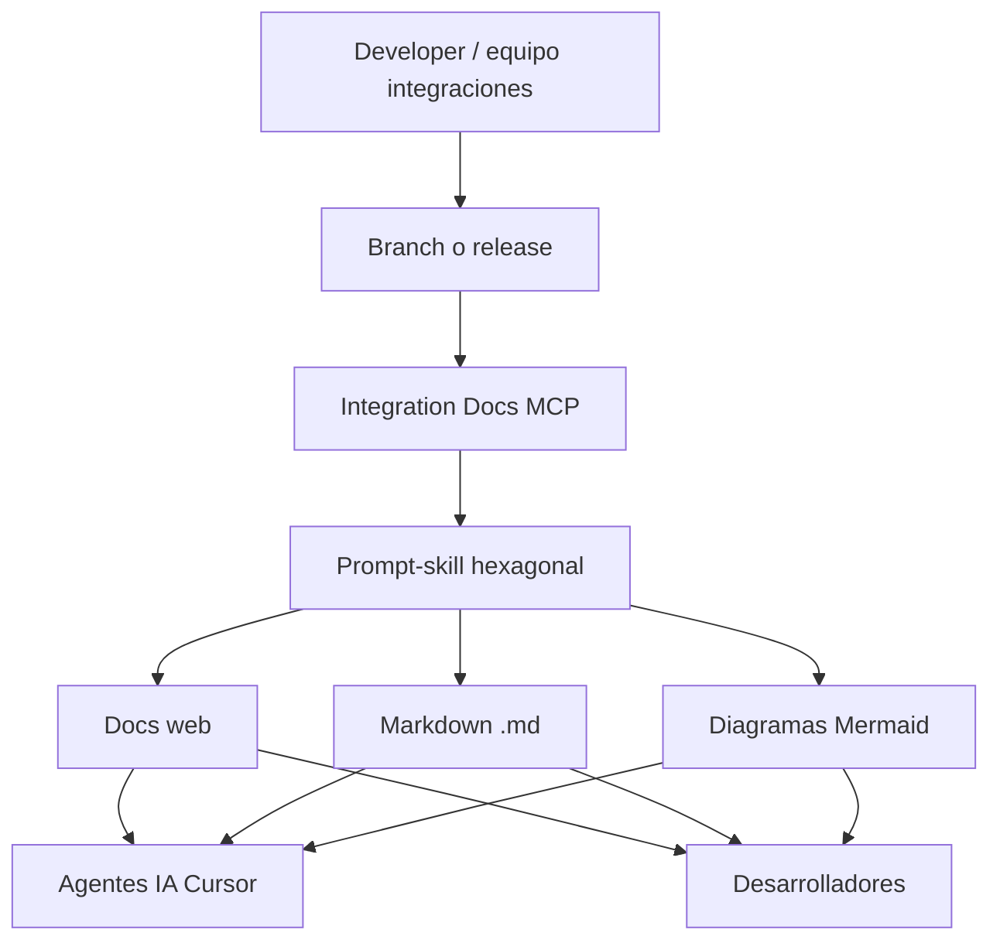

## Resumen ejecutivo

En **Mercado Pago** lideré un **desarrollo aparte** del flujo QR: un **servidor MCP** con un **prompt-skill** orientado a la **arquitectura hexagonal** del dominio de **integraciones** de la compañía (transversal a QR, adquirentes, contratos y flujos afines).

El objetivo: una **base de contexto única** para **agentes de IA** y para **desarrolladores humanos**, con documentación en **formato web y Markdown** y **diagramas de flujo estilo Mermaid**, mantenida alineada con el código tras cambios en branch o releases creadas por cada equipo.

El MCP quedó **disponible para todos los equipos de integraciones de Mercado Pago** — no como artefacto local de un solo squad.

## Contexto y alcance

| En alcance | Fuera de alcance |
|------------|------------------|
| Contexto hexagonal del dominio de integraciones | Lógica transaccional de pagos en Go |
| Automatización de documentación dev (web + `.md`) | Sustituir el código fuente de integraciones |
| Diagramas Mermaid generados/ajustados con el flujo | Documentación solo para flujo QR |
| MCP publicado para consumo cross-team | Herramienta privada de un único equipo |
| Actualización post-merge / post-release | CMS o wiki desacoplada del ciclo de desarrollo |

**Relación con QR Interop:** proyectos **independientes**. La plataforma QR es una implementación concreta; este MCP documenta y contextualiza el **patrón de integraciones** que comparten múltiples equipos.

## Arquitectura

<Callout variant="highlight" title="Por qué MCP">
  Centralizar el contexto en un **MCP compartido** evita copias divergentes del mismo prompt-skill en cada repo y permite que cualquier equipo de integraciones consuma la misma base arquitectónica actualizada.
</Callout>

## Capacidades clave

| Capacidad | Descripción |
|-----------|-------------|
| Arquitectura hexagonal | Contexto de puertos, adaptadores y flujos del dominio integraciones |
| Docs web | Vista navegable para onboarding y referencia rápida |
| Markdown | Artefactos versionables junto al código o en repos de docs |
| Mermaid | Diagramas de flujo alineados al estado del flujo documentado |
| Multi-equipo | Un solo MCP para todos los squads de integraciones |
| Post-release sync | Documentación refrescada tras merge o release del developer |

## Decisiones de diseño

| Principio | Implementación |
|-----------|----------------|
| Separación de dominios | MCP de documentación ≠ plataforma QR transaccional |
| Un contexto, muchos equipos | Servidor MCP organizacional, no skill local |
| IA + humanos | Misma fuente de verdad para Cursor y lectura manual |
| Diagramas como código | Mermaid embebido en `.md` y vistas web |
| Frescura documental | Pipeline atado al ciclo branch/release, no edits manuales sueltos |

## Métricas e impacto

<MetricCard value="MCP" label="Canal de distribución" />
<MetricCard value="All" label="Equipos de integraciones" />
<MetricCard value="2" label="Formatos de salida (web + .md)" />

## Estado

- MCP **publicado y disponible** para equipos de integraciones en **Mercado Pago**
- Prompt-skill operativo con contexto hexagonal y generación/ajuste de Mermaid
- **Proyecto cerrado** al finalizar el periodo en la compañía (ene 2026); handover del servidor y convenciones de actualización

## Galería

<ProjectGallery slug="integration-docs-mcp" />
