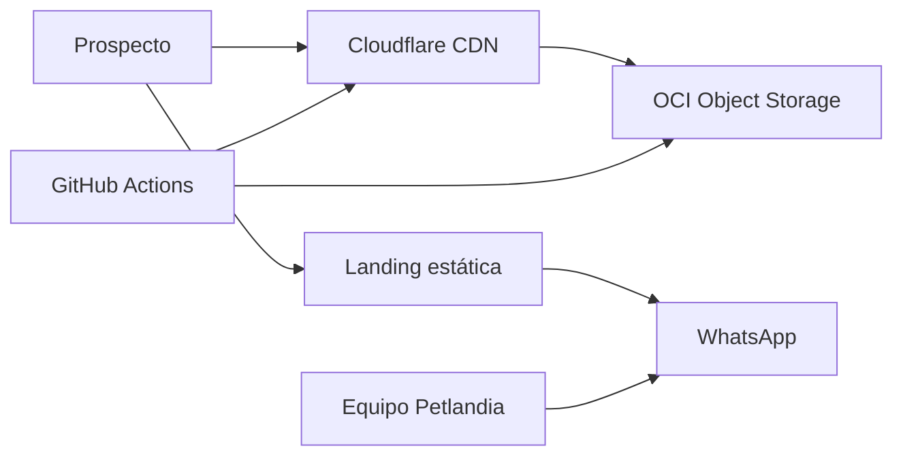
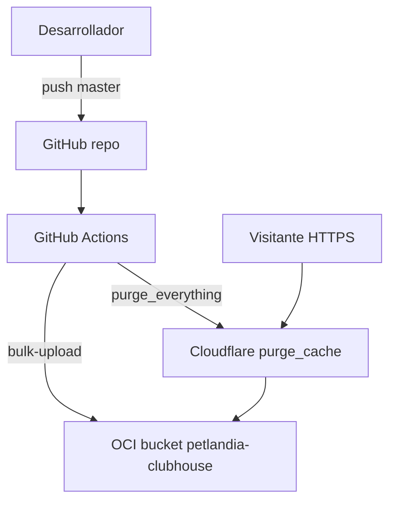

## Resumen ejecutivo

**Club House Petlandia** ([petlandiaclubhouse.com](https://petlandiaclubhouse.com/)) es una landing page **estática** para un negocio de guardería, hotel y spa para perros y gatos en Madrid, Cundinamarca (Colombia). El objetivo de negocio es claro: **captar leads y agendar visitas por WhatsApp**, con confianza visual (instalaciones reales, galería, reseñas) y SEO local.

Aunque el stack es deliberadamente sencillo — **HTML5, CSS3 y JavaScript vanilla** sin build obligatorio — el proyecto fue clave para consolidar **despliegue cloud independiente**: repositorio propio, secretos en GitHub Actions, subida a **Oracle Cloud Infrastructure (Object Storage)** y entrega global vía **Cloudflare** (DNS, proxy, CDN y purge automático post-deploy). Diseñé la arquitectura, el front, el pipeline y la operación de punta a punta.

## Contexto y alcance

| En alcance | Fuera de alcance / preparado |
|------------|------------------------------|
| Landing principal + 2 páginas SEO satélite | Backend de leads en OCI (comentado en código) |
| CTAs y formulario → WhatsApp con mensaje prellenado | Google Places API dinámica (preparado) |
| Galería flip, tarjetas de servicio, mapa embebido | CMS o panel de administración |
| Schema.org `PetBoarding`, meta y canonical por página | Base de datos |
| Pipeline CI/CD en push a `master` | Contenedores / VMs |

### Páginas publicadas

| Ruta | Propósito |
|------|-----------|
| `/` | Landing principal — hotel y guardería mascotas Madrid |
| `/hotel-canino-madrid/` | SEO dedicada perros |
| `/guarderia-gatos-madrid/` | SEO dedicada gatos |

## Arquitectura

Patrón **sitio estático (JAMstack-lite)**: el navegador consume HTML/CSS/JS desde el edge; no hay servidor de aplicación.

### Contexto del sistema

### Pipeline de despliegue

<Callout variant="highlight" title="Aprendizaje principal">
  Configuré credenciales OCI y Cloudflare como secrets de Actions, validé el flujo completo de invalidación de caché tras cada deploy y documenté la operación para que el cliente no dependa de un PaaS tipo Vercel para este sitio.
</Callout>

## Capacidades clave

### Presentación y conversión

| ID | Capacidad | Estado |
|----|-----------|--------|
| RF-01 | Hero, 6 servicios en tarjetas flip, video Pasadía | ✅ |
| RF-02 | Galería de mascotas con testimonios en reverso | ✅ |
| RF-03 | Reseñas estáticas + enlace a Google Maps | ✅ |
| RF-04 | CTA flotante, formulario validado → WhatsApp | ✅ |
| RF-05 | Mapa embebido, datos de contacto, nav móvil | ✅ |

### Front y calidad

| ID | Capacidad | Estado |
|----|-----------|--------|
| RNF-04 | JS en IIFE, API `window.Petlandia` | ✅ |
| RNF-05 | Responsive 380px–1024px+, menú hamburguesa | ✅ |
| RNF-06 | Meta, canonical, JSON-LD `PetBoarding` | ✅ |
| RNF-07 | CSS BEM-like, sin build step obligatorio | ✅ |

### Operaciones cloud

| ID | Capacidad | Estado |
|----|-----------|--------|
| DEP-01 | Workflow `deployLanding.yml` en push a `master` | ✅ |
| DEP-02 | `oci os object bulk-upload` excluyendo `.git`, `.github` | ✅ |
| DEP-03 | Purge Cloudflare post-deploy | ✅ |
| DEP-04 | Servidor local Python (`runlocal.ps1`, puerto 5500) | ✅ |

## Decisiones de diseño

| Principio | Implementación |
|-----------|----------------|
| Conversión primero | WhatsApp como canal único; mensajes prellenados por servicio |
| Coste mínimo | Object Storage + Cloudflare free tier, sin DB ni runtime |
| SEO local | Tres HTML independientes con keywords Madrid / Cundinamarca |
| Mantenibilidad sin framework | Edición directa de assets; deploy automatizado compensa ausencia de bundler |
| Seguridad operativa | Secrets en GitHub; sin credenciales en el repo |

## Métricas e impacto

<MetricCard value="3" label="Páginas SEO en producción" />
<MetricCard value="0" label="Servidores de aplicación" />
<MetricCard value="1" label="Pipeline CI/CD (push → OCI → CF)" />

## Estado y roadmap

- **Producción:** [petlandiaclubhouse.com](https://petlandiaclubhouse.com/) activo
- **Completado:** pipeline OCI + Cloudflare, landings satélite, formulario → WhatsApp
- **Preparado:** endpoint API OCI para leads (código comentado)
- **Opcional:** Google Places API para reseñas dinámicas; galería felina deshabilitada en HTML

## Galería

<ProjectGallery slug="petlandia-landing" />
