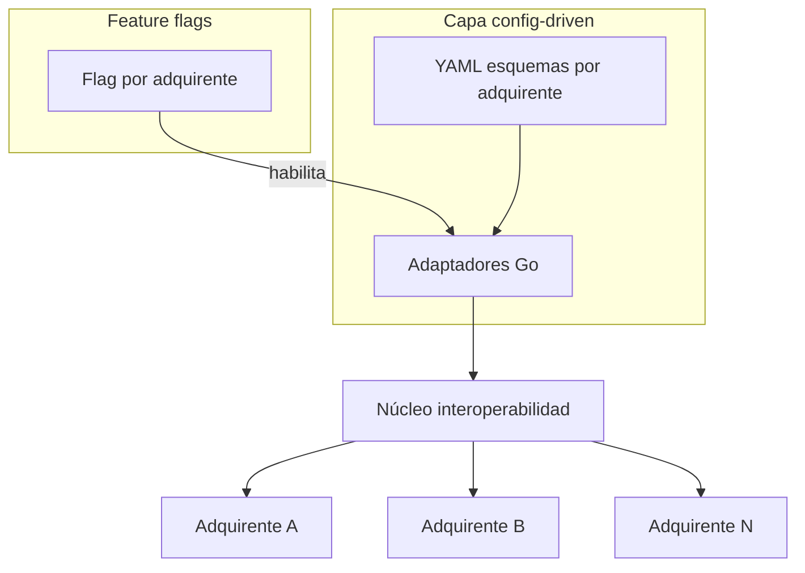

## Resumen ejecutivo

En **Mercado Pago** (feb 2024 – ene 2026) participé en el diseño de la **plataforma de interoperabilidad QR** para integraciones con adquirentes en LATAM. El problema: cada nuevo adquirente implicaba código repetitivo, tiempos largos de onboarding y riesgo de bloquear el núcleo transaccional.

La respuesta fue una arquitectura **config-driven**: esquemas y adaptadores Go reutilizables por país/adquirente, más **infraestructura de feature flags** que permitió a más de diez equipos trabajar en paralelo sin interferir en releases del core.

## Contexto y alcance

| En alcance | Fuera de alcance |
|------------|------------------|
| Integraciones QR con adquirentes LATAM | Producto de pagos al consumidor final |
| Alta de adquirentes vía configuración | Lógica de negocio duplicada por país en código |
| Feature flags por adquirente / capability | Monolito sin gates de despliegue |
| Adaptadores y contratos estables hacia el núcleo | Integraciones fuera del dominio QR interop |

**Rol:** backend engineer en el equipo de interoperabilidad — diseño de adaptadores, contratos de configuración y coordinación de flags para desarrollo paralelo.

## Arquitectura

<Callout variant="highlight" title="Idea central">
  Un adquirente nuevo debería ser principalmente **configuración + adaptador acotado**, no un fork del servicio. Los flags permiten encender integraciones por país o adquirente sin desplegar ramas largas del núcleo.
</Callout>

## Capacidades clave

| Área | Capacidad | Resultado |
|------|-----------|-----------|
| Config | Esquemas YAML por adquirente y país | Onboarding estandarizado |
| Código | Adaptadores Go plug-in hacia el core | Menos duplicación |
| Flags | Toggle por adquirente / capability | Desarrollo paralelo sin bloqueos |
| Ops | Despliegue gradual por flag | Menor riesgo en producción |
| Calidad | Contratos y pruebas por adaptador | Regresiones acotadas al cambio |

### Flujo config-driven (resumido)

1. **Definición** — equipo de producto/integración publica esquema y mapping del adquirente.
2. **Adaptador** — implementación Go que traduce requests/responses al contrato del núcleo.
3. **Flag** — habilitación en entorno staging → producción por país.
4. **Validación** — pruebas de contrato y smoke en sandbox del adquirente.
5. **Handover** — documentación operativa para el equipo de mantenimiento.

## Decisiones de diseño

| Principio | Implementación |
|-----------|----------------|
| Config over copy-paste | Variabilidad por adquirente en YAML, no ramas de servicio |
| Core estable | Núcleo transaccional sin conocer detalles de cada adquirente |
| Parallel safe | Flags desacoplan equipos y releases |
| LATAM-first | Modelo pensado para múltiples países y regulaciones locales |
| Operabilidad | Handover explícito al cerrar el periodo en MP |

## Métricas e impacto

<MetricCard value="10+" label="Adquirentes en paralelo" />
<MetricCard value="~80%" label="Reducción lead time integración" />
<MetricCard value="LATAM" label="Cobertura multi-país" />

## Estado y roadmap

### Al cierre (ene 2026)

- Plataforma en **producción** para múltiples países LATAM
- Proceso de alta de adquirentes **estandarizado** vía configuración
- **Handover documentado** al equipo de mantenimiento de interoperabilidad

### Lecciones transferibles

- Los flags solo escalan si el **contrato del adaptador** es estable
- La configuración debe versionarse y revisarse como código
- El mayor ahorro de lead time viene de **plantillas** de integración, no de menos QA

## Galería

<ProjectGallery slug="qr-interop-platform" />
