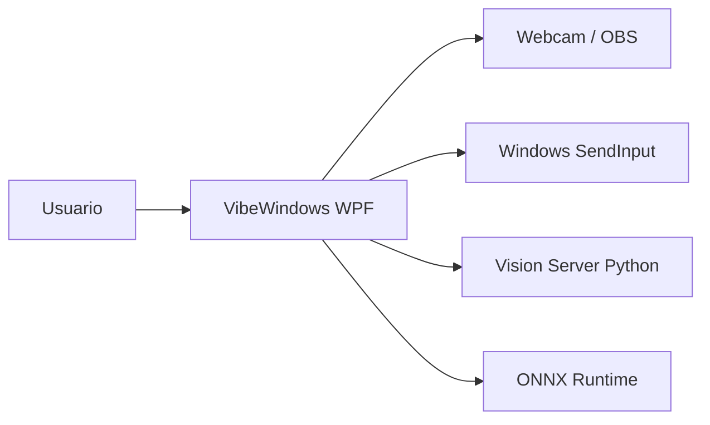
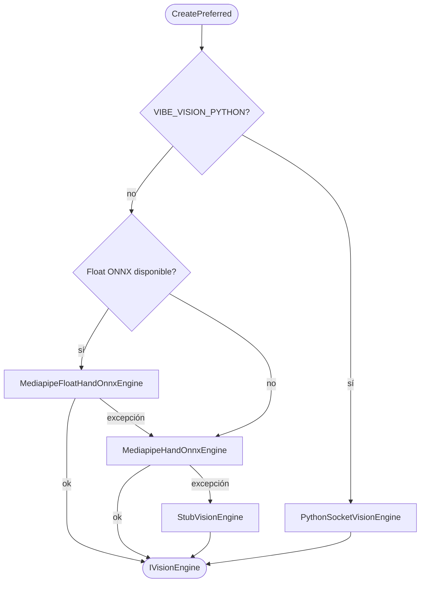

## Resumen ejecutivo

**VibeWindows** es una aplicación de escritorio **WPF (.NET 8)** para Windows que permite controlar el PC principalmente con **cámara y gestos de mano**, sin cerrar la puerta a otras aplicaciones que también necesiten visión (captura única, redistribución interna y, en roadmap, cámara virtual).

El producto captura vídeo de webcam, infiere **landmarks de mano** (ONNX en proceso o MediaPipe Tasks vía TCP), opcionalmente **mueve el cursor** del escritorio virtual y ofrece una **vista de depuración tipo Kinect** (vídeo, overlay, métricas, mapa multi-monitor). Soy autor del diseño y la implementación en los repositorios `WUI/`, `PyHands/` y `python/`.

**Versión actual:** `0.2.2` — **Fase A / MVP núcleo** (~95 % checklist). Pendiente validación formal **M5** (escenarios 1 y 2 monitores).

## Contexto y alcance

| En alcance | Fuera de alcance (por ahora) |
|------------|------------------------------|
| Captura webcam + inferencia manos | Voz / STT (Fase C) |
| Control de cursor por gestos (opcional) | Lengua de señas (Fase D) |
| Vista Kinect + mapa de monitores | Agente con contexto de pantalla (Fase E) |
| Motores Python TCP u ONNX in-process | Cámara virtual publicada (driver pendiente) |
| Seguridad de inyección (OFF por defecto) | Reserva / automatización de apps de terceros |

## Arquitectura

Flujo lógico unificado implementado en WUI:

```
Cámara → CaptureBroker → VisionSession → IVisionEngine → VisionResult
                                              ↓
                                    GesturePolicy → PointerDriver
                                              ↓
                                    InjectionSafety (OFF por defecto)
```

<ReactFlowDiagram preset="vibewindows" />

### Contexto del sistema



### Selección automática del motor de visión



## Capacidades clave

### Interfaz y depuración

| ID | Capacidad | Estado |
|----|-----------|--------|
| RF-UI-01 | Ventana principal con estado del motor y versión | ✅ |
| RF-UI-02 | Indicador claro cuando inyección está desactivada | ✅ |
| RF-UI-05 | Vista Kinect (vídeo, overlay, métricas) | ✅ |
| RF-UI-07 | Mapa de monitores, cursor/mano, recalibrar alcance | ✅ v0.2.2 |
| RF-UI-08 | Tema Solarized Light | ✅ |

### Visión e inferencia

| ID | Capacidad | Estado |
|----|-----------|--------|
| RF-VIS-01 | Contrato `IVisionEngine` → `VisionResult` | ✅ |
| RF-VIS-04 | Motor Python por TCP (landmarks + preview JPEG) | ✅ |
| RF-VIS-02/03 | Motores ONNX Zoo y Float (OpenCV / QAIRT) | ✅ |
| RF-VIS-07 | Captura única multiplexada (`CaptureBroker`) | ✅ |
| RF-VIS-08 | Watchdog reconexión Python (`camera_lost`) | ✅ |
| RF-VIS-09 | Cámara virtual hacia apps externas | ⏳ |

### Gestos y puntero

| ID | Capacidad | Estado |
|----|-----------|--------|
| RF-GES-01 | Mover cursor: índice + medio extendidos (ancla anular+meñique) | ✅ |
| RF-GES-02 | Clic izquierdo: pulgar → índice (pinch con histéresis) | ✅ |
| RF-GES-03 | Clic derecho: pulgar → medio | ✅ |
| RF-GES-04 | Solo palma hacia cámara (configurable) | ✅ |
| RF-GES-05 | Mapeo a escritorio virtual multi-monitor | ✅ v0.2.2 |
| RF-GES-06 | Calibración de alcance XY y compensación de lejanía | ✅ v0.2.2 |
| RF-GES-07 | Suavizado adaptativo del puntero | ✅ v0.2.2 |

### Seguridad de entrada

| ID | Capacidad | Estado |
|----|-----------|--------|
| RF-SEC-01 | Inyección de ratón **OFF** al arranque | ✅ |
| RF-SEC-02 | Activación voluntaria en UI | ✅ |
| RF-SEC-04 | Parada de emergencia **Ctrl+Shift+E** | ✅ |
| RF-SEC-05 | Ratón físico desactiva inyección al moverse | ✅ |

<Callout variant="highlight" title="Seguridad por diseño">
  La inyección de cursor nunca se activa sin acción explícita del usuario. Todas las rutas `SendInput` respetan `InjectionSafety`, y el movimiento sintético no se confunde con entrada física gracias a `SyntheticInputTracker`.
</Callout>

## Decisiones de diseño

| Principio | Implementación |
|-----------|----------------|
| Contrato único de salida | `VisionResult` / `HandState` — todos los motores convergen aquí |
| Separación visión / gesto | `IVisionEngine` no conoce el ratón; `GesturePolicy` no conoce ONNX |
| Seguridad por defecto | `InjectionSafety` OFF; rescate Ctrl+Shift+E + ratón físico |
| Latencia controlada | Colas tamaño 1, `DropOldest`, stride de inferencia, buffer cámara 1 |
| Degradación elegante | Factory: Python → Float ONNX → Zoo ONNX → `StubVisionEngine` |
| Configuración centralizada | `VisionConfig` y variables `VIBE_*` |

## Métricas e impacto

<MetricCard value="0.2.2" label="Versión WUI" />
<MetricCard value="~95%" label="Checklist MVP núcleo" />
<MetricCard value="2" label="Motores ONNX + Python TCP" />

## Estado y roadmap

### Fases de producto

| Fase | Contenido | Estado |
|------|-----------|--------|
| **A — MVP** | Captura, landmarks, cursor, clic, vista Kinect | **En curso** (~95 %) |
| **B — Robustez** | Calibración formal M5, perfiles, kill switch refinado | Parcial |
| **C — Voz** | Dictado / comandos | No iniciado |
| **D — Lengua de señas** | Secuencias temporales | No iniciado |
| **E — Agente + pantalla** | Contexto, `ActionGate` | No iniciado |

### Pendientes inmediatos

- Validación **M5**: comportamiento estable en 1 y 2 monitores
- Driver **VibeVirtualCam** (buffer `LatestFrameBufferSink` listo)
- Gestos de ventana reservados en `GesturePreferences`
- Empaquetado instalable para distribución

## Galería

<ProjectGallery slug="vibewindows" />
