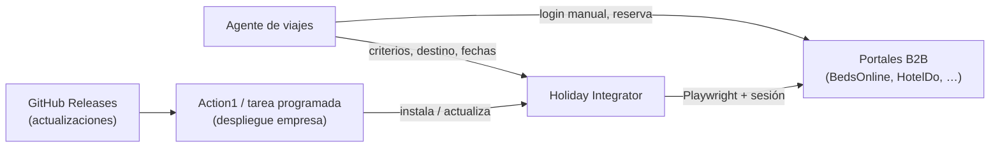
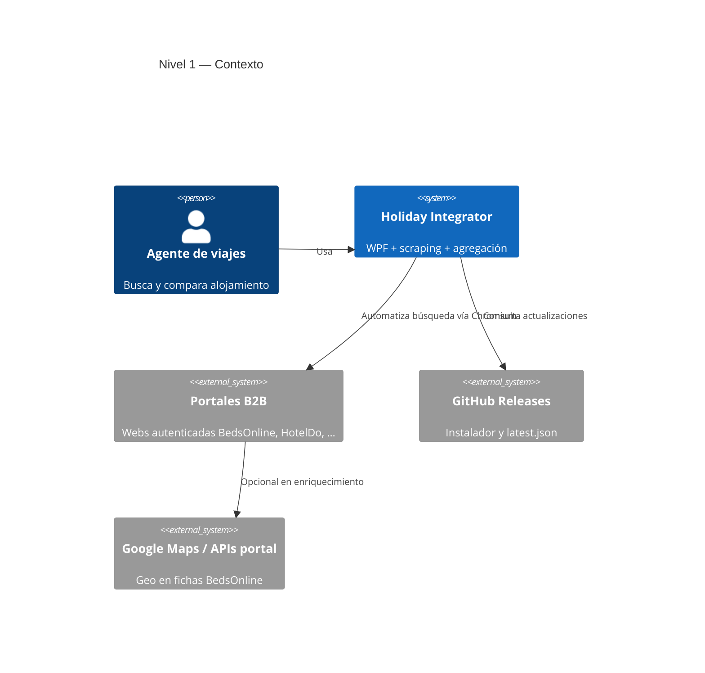
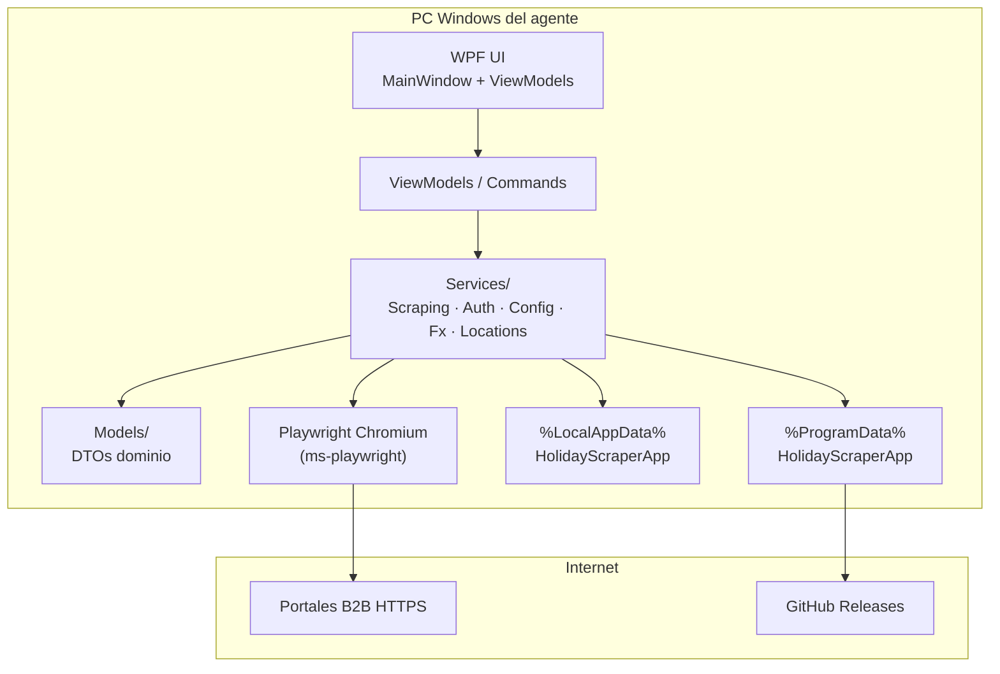
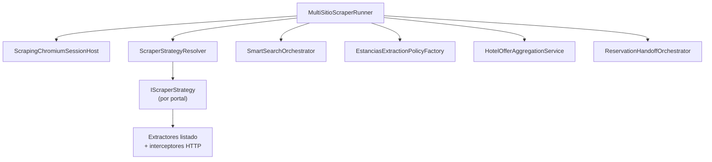
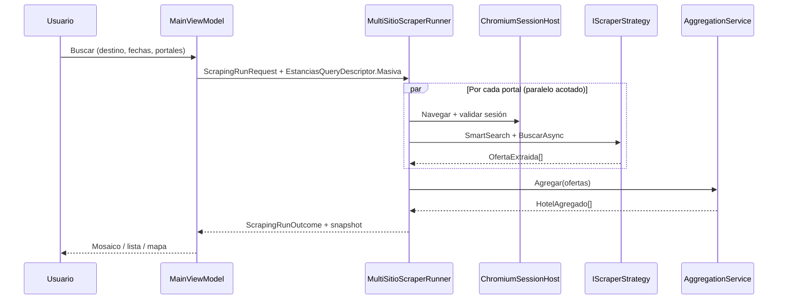
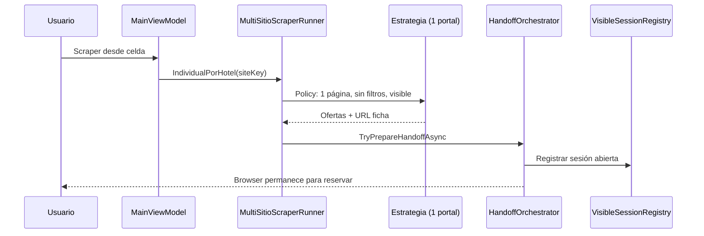
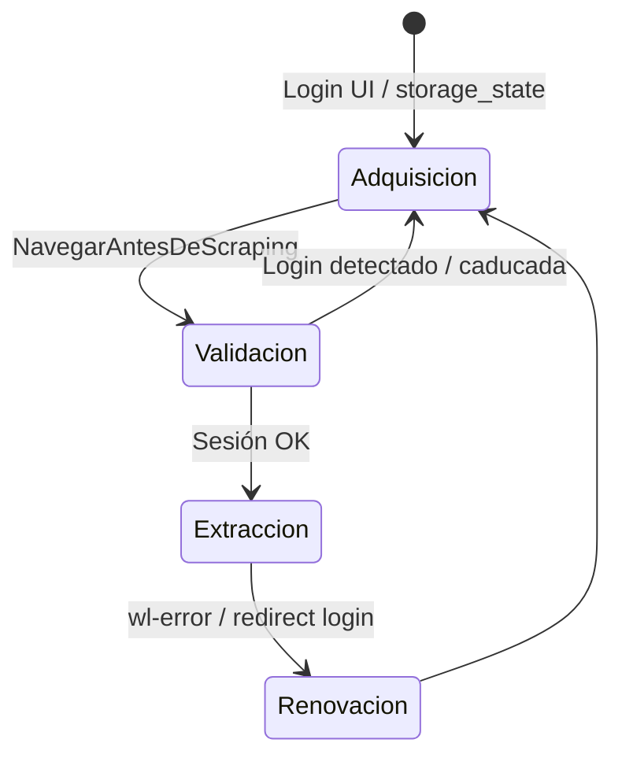

# Holiday Integrator — Visión, arquitectura y especificación unificada

**Producto:** Holiday Integrator (`HolidayScraperApp`) — aplicación de escritorio para agencias que comparan precios de alojamiento en varios portales B2B en paralelo.

**Audiencia:** desarrolladores, arquitectos, operaciones y agentes de IA que necesitan una vista única del sistema antes de profundizar en documentos especializados.

**Última revisión documental:** mayo 2026.

---

## Cómo usar este documento

| Necesitas… | Ve a la sección |
|------------|-----------------|
| Entender el negocio y alcance | [§1 Visión](#1-visión-y-alcance) · [§2 Requisitos funcionales](#2-requisitos-funcionales) |
| Diagramas por nivel de abstracción | [§3 Arquitectura en capas](#3-arquitectura-en-capas-diagramas) |
| Modelo de consulta Estancias | [§4 Modelo de dominio](#4-modelo-de-dominio-consulta-estancias) |
| Portales y estrategias | [§5 Inventario de portales](#5-inventario-de-portales-estancias) |
| Correlación multi-portal | [§6 Agregación](#6-agregación-multi-portal) |
| Calidad, rendimiento, despliegue | [§7–9](#7-requisitos-no-funcionales) |
| Detalle operativo (selectores, XHR) | [§10 Mapa de documentación](#10-mapa-de-documentación-especializada) |

Los documentos históricos (`ARQUITECTURA.md`, `Flujos/`, `MejoraContinua/`) **siguen siendo la fuente de detalle**; este archivo los **sintetiza** y enlaza.

---

## 1. Visión y alcance

### 1.1 Problema

Las agencias de viajes consultan el mismo alojamiento en varios portales mayoristas (BedsOnline, HotelDo, TravelC, etc.). Cada portal tiene su propia UI, sesión, contratos de red y nomenclatura. Comparar manualmente es lento y propenso a errores.

### 1.2 Solución

Automatizar, con **Playwright (Chromium)**, el flujo de búsqueda en cada portal habilitado, extraer ofertas estructuradas (`OfertaExtraida`), **correlacionar** ofertas que representan el mismo hotel (`HotelAgregado`) y presentarlas en una **UI WPF** (mosaico, lista, mapa).

### 1.3 Alcance actual (servicio principal)

| En alcance | Fuera de alcance / parcial |
|------------|----------------------------|
| Servicio **Estancias** (alojamiento) multi-portal | Otros servicios del catálogo (`Parques`, `Vuelos`, …) en `sitios_config.json` sin estrategia `IScraperStrategy` |
| Búsqueda masiva comparativa | Reserva automática end-to-end |
| Consulta individual / handoff a portal para reservar | Sincronización de inventario en tiempo real |
| Comprobación visible desde mosaico (`MosaicVisible`) | Portal genérico «plug-and-play» sin código por sitio |

### 1.4 Actores



---

## 2. Requisitos funcionales

### 2.1 Gestión de portales y sesión

| ID | Requisito | Notas |
|----|-----------|-------|
| RF-01 | Registrar credenciales por portal cifradas (DPAPI) | `%LocalAppData%\HolidayScraperApp\` |
| RF-02 | Login interactivo cuando el portal lo exige | Botón «Login…»; perfil Chromium persistente |
| RF-03 | Persistir `storage_state` por `siteKey` | Reutilización entre runs |
| RF-04 | Detectar página de login antes de extraer | `LoginPageDetectionEvaluator` |
| RF-05 | Configurar portales activos por servicio | `sitios_config.json` + UI |

### 2.2 Búsqueda y extracción (Estancias)

| ID | Requisito | Notas |
|----|-----------|-------|
| RF-10 | Búsqueda **masiva** multi-portal en paralelo | `QueryMode.Masiva`, `SearchIntent` destino u hotel |
| RF-11 | Autocompletado destino/hotel según intención | `SmartSearchOrchestrator` + handler por portal |
| RF-12 | Rellenar formulario: fechas, noches, ocupación, categoría, régimen | Estrategia + `Occupancy` por portal |
| RF-13 | Extraer listado priorizando **XHR/JSON** sobre DOM | Interceptores Beds, JSONL HotelDo, partial TravelC |
| RF-14 | Paginación profunda en masiva (límites por portal/policy) | p. ej. HotelDo hasta 40 páginas |
| RF-15 | Aplicar filtros laterales cuando la policy lo indica | HotelDo, PriceAgencies, TravelC |
| RF-16 | Consulta **individual** desde celda del mosaico | Un portal, 1 página, browser visible, handoff |
| RF-17 | **Handoff de reserva**: mantener browser abierto en ficha | `ReservationHandoffOrchestrator` |
| RF-18 | Comprobación **mosaico visible** sin extracción de listado | `QueryMode.MosaicVisible`; filtros o goto URL según intent |
| RF-19 | Overrides de selectores por sitio | `site_scraper_overrides.json` en LocalAppData |

### 2.3 Presentación y comparativa

| ID | Requisito | Notas |
|----|-----------|-------|
| RF-20 | Mostrar resultados en mosaico por `HotelAgregado` | Precio por portal, miniaturas |
| RF-21 | Vista lista y mapa (WebView2) | Requiere WebView2 Runtime en Windows |
| RF-22 | Conversión de moneda a COP para comparar | `Services/Fx/` |
| RF-23 | Rehidratar búsqueda reciente (~6 h TTL) | `SearchRunSnapshot` |
| RF-24 | Catálogo de destinos (semilla + SQLite) | `Data/locations_seed.json` |

### 2.4 Correlación multi-portal

| ID | Requisito | Notas |
|----|-----------|-------|
| RF-30 | Agrupar ofertas del mismo hotel físico | `HotelOfferAggregationService` (Union-Find restringido) |
| RF-31 | No fusionar ofertas del mismo portal en un grupo | Máximo una oferta por `SiteKey` por clúster |
| RF-32 | Respetar ubicación canónica del destino | `UbicacionCanonicaId` (GeonameId) |
| RF-33 | Compatibilidad de estrellas (±1) configurable | Por defecto activo |

### 2.5 Operación y mejora continua

| ID | Requisito | Notas |
|----|-----------|-------|
| RF-40 | Trazas de diagnóstico por portal en UI Depuración | `IScrapingDebugTrace` |
| RF-41 | Artefactos de red (JSONL, `.network.json`) | Prioridad sobre DOM masivo |
| RF-42 | Capturas DOM puntuales en hitos | `ScrapingDomCaptureService` (complemento) |
| RF-43 | Informes de rendimiento por run | `MejoraContinua/Reportes/` |
| RF-44 | Auto-actualización vía manifiesto `latest.json` | Instalador Inno + scripts `Deploy/` |

---

## 3. Arquitectura en capas (diagramas)

### 3.1 Nivel 1 — Contexto del sistema



### 3.2 Nivel 2 — Contenedores



| Contenedor | Tecnología | Responsabilidad |
|------------|------------|-----------------|
| UI | WPF (.NET 8) | Formulario, mosaico, mapa, login, depuración |
| ViewModels | MVVM (`CommunityToolkit.Mvvm`) | Orquestación UI, `ScrapingRunRequest` |
| Services | C# | Scraping, agregación, auth, métricas |
| Models | Records / enums | Contratos de datos estables |
| Playwright | Chromium embebido | Navegación, interceptores, sesión |
| LocalAppData | JSON, SQLite, perfiles | Sesiones, snapshots, overrides, DOM de run |
| ProgramData | JSON + logs | Config y logs de auto-update |

### 3.3 Nivel 3 — Componentes (motor Estancias)



**Árbol de código (`Services/Scraping/`):**

```
Core/                    # MultiSitioScraperRunner, ScrapingRunRequest/Outcome
CrossCutting/            # Login, mapping, overlays
Aggregation/             # HotelOfferAggregationService, DSU, geo, nombres
Diagnostics/             # DomCapture, waits
Services/Estancias/
  Core/                  # ScraperStrategyResolver
  SmartSearch/           # Autocompletado por portal
  Occupancy/             # Habitaciones / viajeros
  QueryModes/            # Masiva · Individual · MosaicVisible + Handoff
  Portals/               # BedsOnline, HotelDo, TravelC, PriceAgencies, DreamVacationWeak
```

### 3.4 Nivel 4 — Secuencia: búsqueda masiva



### 3.5 Nivel 4 — Secuencia: individual + handoff



### 3.6 Pipeline interno por portal (especificación técnica)

```
ScrapingChromiumSessionHost.NavegarAntesDeScrapingAsync()
  → LoginPageDetectionEvaluator
  → SmartSearchOrchestrator (según SearchIntent)
  → ScraperExecutionContext (+ EstanciasQuery + ExtractionPolicy)
  → IScraperStrategy.BuscarAsync()
      → formulario (fechas, ocupación, categoría, régimen)
      → clic «Buscar» + await red (XHR / partial/ajax / navegación)
      → extractor:
          · interceptores HTTP (Beds client-hotel-avail-api, HotelDo JSONL, PriceAgencies filter API)
          · DOM tarjetas como respaldo
      → enriquecimiento ficha solo si policy.EnriquecerFichasDetalle
  → [Individual] ReservationHandoffOrchestrator
```

**Política de red (obligatoria en diseño):** cada interacción que dispare render asíncrono va seguida de un **await de red** explícito antes del siguiente paso.

---

## 4. Modelo de dominio — consulta Estancias

### 4.1 Cuatro ejes de parametrización

| Eje | Valores | Ubicación |
|-----|---------|-----------|
| **Servicio** | `Estancias` (+ otros en catálogo sin scraper) | `sitios_config.json` |
| **Portal** | `siteKey` | `SitioConfig` |
| **Intent** | `PorDestino` \| `PorHotel` | `SearchIntent` |
| **Mode** | `Masiva` \| `Individual` \| `MosaicVisible` | `QueryMode` |

**Agregado:** `EstanciasQueryDescriptor` → viaja en `ScrapingRunRequest.QueryEstancias` → `ScraperExecutionContext` + `IEstanciasExtractionPolicy`.

### 4.2 Matriz de modos (comportamiento)

| Escenario UI | Intent | Mode | Extracción | Browser | Handoff |
|--------------|--------|------|------------|---------|---------|
| Buscar multi-portal | PorDestino (típ.) | Masiva | Completa + agregación | Headless (defecto) | No |
| Buscar por hotel (masiva) | PorHotel | Masiva | Listado acotado (1 pág. HD/PA) | Headless | No |
| Scraper celda → reservar | PorHotel | Individual | 1 página, sin filtros | Visible | Sí |
| Robot mosaico (comprobar) | PorDestino / PorHotel | MosaicVisible | **Omitida**; filtros o goto URL | Visible persistente | Browser abierto |

### 4.3 Políticas de extracción (`IEstanciasExtractionPolicy`)

| Toggle | Masiva | Individual | MosaicVisible |
|--------|--------|------------|---------------|
| `MaxPaginasListadoHotelDo` | 40 (1 si PorHotel) | 1 | 1 |
| `EnriquecerFichasDetalle` | false (2026) | false | false |
| `AplicarFiltrosLateralesHotelDo` | sí (no PorHotel) | no | sí |
| `AplicarFiltrosResultadosTravelC` | sí | no | sí |
| `OmitirExtraccionListado` | no | no | **sí** |
| `DeferBrowserCloseForHandoff` | no | sí | sí |
| `NavegarAUrlOfertaComprobacion` | no | no | sí si PorHotel |

### 4.4 Entidades principales

| Tipo | Rol |
|------|-----|
| `OfertaExtraida` | Oferta enriquecida de un portal (nombre, precio, URL, geo, estrellas) |
| `HotelAgregado` | Grupo lógico; `PorSiteKey` con una oferta por portal como máximo |
| `ScraperBusquedaCriterios` | Fechas, noches, viajeros, categoría, régimen |
| `ReservationHandoffSnapshot` | Estado tras consulta individual para UI |
| `SearchRunSnapshot` | Copia rehidratable del run (TTL ~6 h) |
| `HotelAggregationOptions` | Umbrales de correlación |

---

## 5. Inventario de portales (Estancias)

| SiteKey | Estrategia C# | Extracción principal | Documentación detallada |
|---------|---------------|----------------------|-------------------------|
| `BedsOnline` | `BedsOnlineScraperStrategy` | DOM + `client-hotel-avail-api` | [Flujos/ESTRATEGIAS_ESTANCIAS.md](../Flujos/ESTRATEGIAS_ESTANCIAS.md) · [bedsonline-avail-api.md](../Flujos/bedsonline-avail-api.md) |
| `HotelDo` | `HotelDoScraperStrategy` | JSONL availability + DOM | [hoteldo-extraccion.md](../Flujos/hoteldo-extraccion.md) |
| `FullTrips` / `TravelDepot` | `TravelCHotelesSoloAlojamientoScraperStrategy` | PrimeFaces partial/XHR | [FullTrips.md](../Flujos/FullTrips.md) |
| `PriceAgencies` | `PriceAgenciesScraperStrategy` | API `filter/v2/list` | [PriceAgencies.md](../Flujos/PriceAgencies.md) |
| `Dream_Vacation_Weak` | `DreamVacationWeakScraperStrategy` | Grid certificados | [DreamVacationWeak.md](../Flujos/DreamVacationWeak.md) |
| Otros en config | `NoOpScraperStrategy` | Sin automatización | — |

**Resolución:** `ScraperStrategyResolver.Resolve(SitioConfig, claveCsvServicio)` — solo `Estancias` obtiene estrategia real.

---

## 6. Agregación multi-portal

### 6.1 Algoritmo (resumen)

- Estructura: **Union-Find restringido** (`PortalConstrainedDisjointSetUnion`).
- Solo se evalúan pares con **`SiteKey` distinto**.
- Candidatos ordenados por similitud de nombre; unión si no rompe regla 1:1 por portal.

### 6.2 Criterios de emparejamiento (AND)

1. **Ubicación canónica:** mismo `UbicacionCanonicaId` si ambas lo tienen; si falta, no bloquea.
2. **Estrellas:** `|Δ| ≤ 1` si ambas tienen categoría y `ExigirEstrellasCompatibles` (default true).
3. **Nombre:** similitud ≥ **0,88** (`HotelNameCorrelationScorer`: min TokenSetRatio, solapamiento tokens).
4. **Alternativa geo:** distancia ≤ **0,7 km** + similitud ≥ **0,45** solo si **ambas** tienen geo real (`GeoEsCentroBusqueda = false`).

### 6.3 Umbrales por defecto

| Parámetro | Valor | Fuente |
|-----------|-------|--------|
| `SimilitudMinima` | 0,88 | `HotelCorrelationDefaults.cs` |
| `CercaniaKm` | 0,7 | idem |
| `SimilitudMinimaConCercaniaReal` | 0,45 | `HotelOfferAggregationService.cs` |

### 6.4 Limitaciones conocidas

- **HotelDo:** coordenadas a menudo son del destino (`GeoEsCentroBusqueda = true`) → emparejamiento Beds↔HotelDo depende casi solo del nombre.
- **BedsOnline:** geo de ficha prioriza interceptor `client-content-api`; Maps DOM es fallback.

**Tests obligatorios al cambiar umbrales:** `HolidayScraperApp.Tests/AggregationTests.cs`.

Detalle: [Flujos/agregacion-emparejamiento.md](../Flujos/agregacion-emparejamiento.md).

---

## 7. Requisitos no funcionales

### 7.1 Plataforma y despliegue

| ID | Requisito | Criterio |
|----|-----------|----------|
| RNF-01 | Windows 10/11 x64 | Instalador self-contained .NET 8 |
| RNF-02 | Sin .NET preinstalado en cliente | Runtime embebido |
| RNF-03 | Primera ejecución descarga Chromium | ~150–300 MB; firewall permitido |
| RNF-04 | WebView2 para mapa | Instalable aparte en Win10 |
| RNF-05 | Actualizaciones firmadas por SHA256 | `latest.json` + `Update-HolidayScraperApp.ps1` |

Ver [INSTALACION.md](INSTALACION.md).

### 7.2 Rendimiento y escalabilidad

| ID | Requisito | Criterio |
|----|-----------|----------|
| RNF-10 | Paralelismo multi-portal acotado | `PlaywrightExtractionCola`; un portal no bloquea a otro |
| RNF-11 | Priorizar XHR/JSON sobre DOM pesado | Perfil de red antes que selectores ([CRITERIOS](../MejoraContinua/CRITERIOS_AGENTES_SCRAPING.md)) |
| RNF-12 | Esperas > 3 s justificadas | Señal DOM/red observable; evitar `Task.Delay` largos ciegos |
| RNF-13 | Paginación con salida | Sin crecimiento, tope de páginas, cancelación usuario |
| RNF-14 | Enriquecimiento paralelo acotado | p. ej. Beds: semáforo 4 fichas cuando esté activo |

### 7.3 Seguridad y privacidad

| ID | Requisito | Criterio |
|----|-----------|----------|
| RNF-20 | Credenciales cifradas DPAPI | No en repo |
| RNF-21 | Sesiones locales por agente | `%LocalAppData%`; desinstalar no borra sesión (intencional) |
| RNF-22 | Stealth razonable en Chromium | `PlaywrightStealth`, UA, init scripts |

### 7.4 Mantenibilidad y observabilidad

| ID | Requisito | Criterio |
|----|-----------|----------|
| RNF-30 | Trazas por portal en run | Debug UI + informes Markdown/JSON |
| RNF-31 | Artefactos versionables en repo | `MejoraContinua/` + `Sync-ScrapingArtifacts.ps1` |
| RNF-32 | Documentar portal nuevo | Resolver + DI + `ESTRATEGIAS_ESTANCIAS.md` + perfil red |
| RNF-33 | Gate antes de cerrar cambio scraping | Comparar run antes/después ([MejoraContinua](../MejoraContinua/README.md)) |

### 7.5 Sesión (tres fases — patrón de diseño)



Referencia: [MejoraContinua/Web Scraping Avanzado en C# dotNET .md](../MejoraContinua/Web%20Scraping%20Avanzado%20en%20C%23%20dotNET%20.md).

---

## 8. Configuración y rutas de datos

### 8.1 Archivos de configuración

| Archivo | Ubicación | Contenido |
|---------|-----------|-----------|
| `sitios_config.json` | Junto al exe | Portales, URLs login, servicios habilitados |
| `site_scraper_overrides.json` | LocalAppData | Selectores, toggles por site |
| `locations_seed.json` | `Data/` | Semilla catálogo destinos |
| `update-config.json` | ProgramData | URL manifiesto, autoInstall |
| `portal_credenciales_dpapi.json` | LocalAppData | Credenciales cifradas |

### 8.2 Datos de usuario y diagnóstico

| Ruta | Contenido |
|------|-----------|
| `%LocalAppData%\HolidayScraperApp\sessions\` | `storage_state_<siteKey>.json` |
| `…\scraping_dom_flujo_run\` | `{SiteKey}_flujo_red.jsonl`, availability JSONL |
| `…\SearchSnapshots\` | Snapshots de búsqueda |
| `%ProgramData%\HolidayScraperApp\logs\` | `update.log` |
| `MejoraContinua/` (repo) | Espejo versionado post-sync |

### 8.3 Arranque e inyección de dependencias

- **Entrada:** `App.xaml.cs` — registra estrategias, `SmartSearchOrchestrator`, `IMultiSitioScraperRunner`, `MainViewModel`, handoff, registro sesiones visibles.
- **Rutas:** `AppPaths.cs` centraliza LocalAppData.

---

## 9. Bucle de mejora continua (especificación operativa)

### 9.1 Prioridad de evidencias

| Orden | Artefacto | Uso |
|-------|-----------|-----|
| 1 | Trazas run / `[Portal/XHR]` | Correlacionar paso ↔ petición |
| 2 | `*_flujo_red.jsonl`, `HotelDo_availability_xhr.jsonl` | Contrato JSON |
| 3 | `*.network.json` en hitos | Resumen peticiones |
| 4 | `Reportes/rendimiento_scraping/*.md` | Regresiones de tiempo |
| 5 | HTML/PNG `Dom/` | Layout, overlays, selectores rotos |

### 9.2 Checklist obligatorio para agentes (resumen)

1. Login detectado con reglas explícitas.
2. Cobertura listado registrada (nodos vs ofertas válidas).
3. Fuentes baratas antes que DOM pesado.
4. Aislamiento de errores por portal.
5. Comparar run antes/después antes de dar por cerrada una tarea.

Texto completo: [MejoraContinua/CRITERIOS_AGENTES_SCRAPING.md](../MejoraContinua/CRITERIOS_AGENTES_SCRAPING.md).

### 9.3 Madurez HTTP híbrido

Proceso para pasar de Playwright a `HttpClient` por portal: [PROFILING_VALIDACION_HTTP_HIBRIDO.md](PROFILING_VALIDACION_HTTP_HIBRIDO.md) + plantilla [Flujos/PLANTILLA_PERFIL_RED.md](../Flujos/PLANTILLA_PERFIL_RED.md).

---

## 10. Mapa de documentación especializada

| Tema | Documento |
|------|-----------|
| Índice agentes IA | [AGENTS.md](../AGENTS.md) |
| Arquitectura técnica (resumen código) | [ARQUITECTURA.md](ARQUITECTURA.md) |
| Instalación / Action1 / updates | [INSTALACION.md](INSTALACION.md) |
| Estrategias y selectores Estancias | [Flujos/ESTRATEGIAS_ESTANCIAS.md](../Flujos/ESTRATEGIAS_ESTANCIAS.md) |
| Índice flujos por portal | [Flujos/README.md](../Flujos/README.md) |
| Agregación detallada | [Flujos/agregacion-emparejamiento.md](../Flujos/agregacion-emparejamiento.md) |
| Profiling red / híbrido HTTP | [PROFILING_VALIDACION_HTTP_HIBRIDO.md](PROFILING_VALIDACION_HTTP_HIBRIDO.md) |
| Bucle artefactos | [MejoraContinua/README.md](../MejoraContinua/README.md) |
| Criterios calidad scraping | [MejoraContinua/CRITERIOS_AGENTES_SCRAPING.md](../MejoraContinua/CRITERIOS_AGENTES_SCRAPING.md) |
| Regla Cursor always-apply | [.cursor/rules/holiday-scraper-app-context.mdc](../.cursor/rules/holiday-scraper-app-context.mdc) |

---

## 11. Guía rápida de extensión

### Nuevo portal Estancias

1. Estrategia en `Services/Scraping/Services/Estancias/Portals/<Portal>/`.
2. Perfil de red en `Flujos/<portal>.md` (plantilla § PLANTILLA_PERFIL_RED).
3. Registrar en `ScraperStrategyResolver` y `App.xaml.cs`.
4. Entrada en `sitios_config.json`.
5. Handler SmartSearch si hay autocompletado.
6. Respetar `context.ExtractionPolicy` en filtros, paginación y enriquecimiento.
7. Actualizar tabla en §5 y `ESTRATEGIAS_ESTANCIAS.md`.

### Depurar extracción (orden)

1. Trazas + JSONL del run en LocalAppData.
2. `Sync-ScrapingArtifacts.ps1 -Full`.
3. Informe rendimiento en `MejoraContinua/Reportes/`.
4. Evaluar interceptor / híbrido HTTP si JSON estable.
5. DOM solo si síntoma visual o selector roto.

### Depurar emparejamientos

1. Snapshot en `MejoraContinua/Snapshots_busqueda/`.
2. Revisar `hotelesAgregados` / `porSiteKey`.
3. Ajustar `HotelCorrelationDefaults.cs` + ejecutar `AggregationTests.cs`.

---

## 12. Glosario

| Término | Significado |
|---------|-------------|
| **SiteKey** | Identificador de portal en config y sesión |
| **Intent** | Buscar por destino geográfico o por nombre de hotel |
| **Mode** | Masiva (comparativa), Individual (handoff), MosaicVisible (comprobación) |
| **Handoff** | Dejar browser del portal abierto en ficha para reserva manual |
| **Union-Find restringido** | Agrupación sin más de una oferta del mismo portal por grupo |
| **GeoEsCentroBusqueda** | Coordenadas del destino, no del hotel — no activa criterio geo cruzado |
| **Perfil de red** | Inventario XHR/JSON documentado antes de tocar CSS |

---

*Este documento unifica requisitos y vistas arquitectónicas dispersas en el repositorio. Ante divergencia con el código fuente, prevalece el código; actualizar este archivo y el documento especializado afectado en el mismo cambio.*
