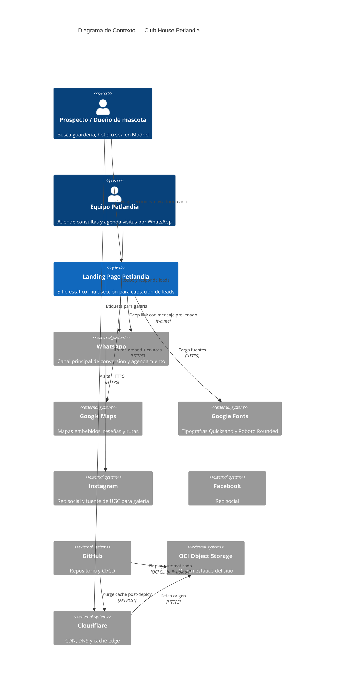
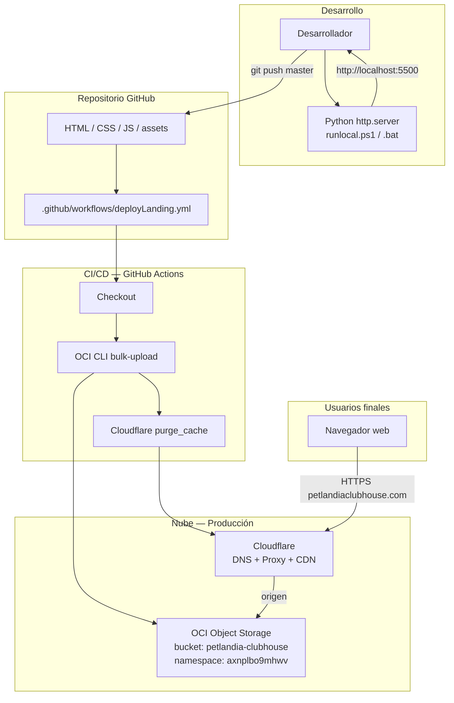
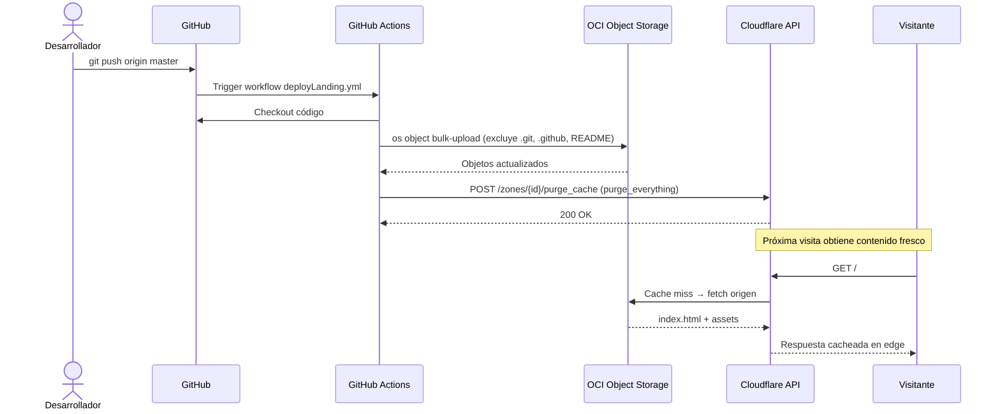
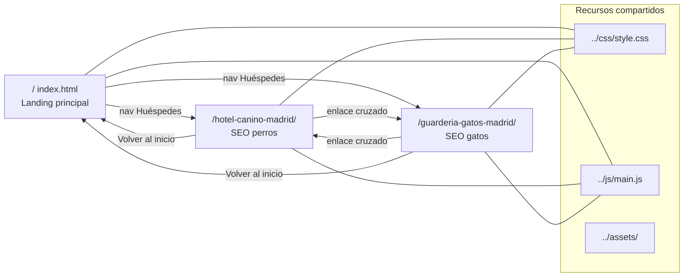
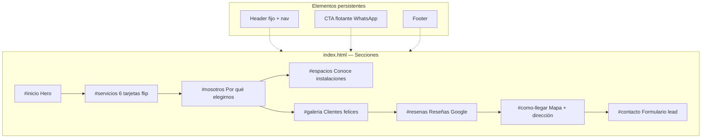
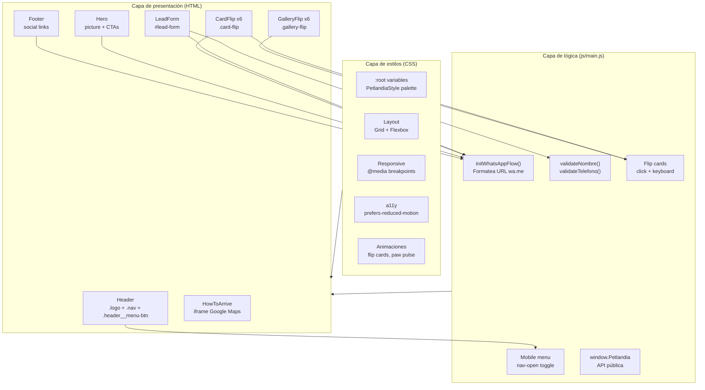
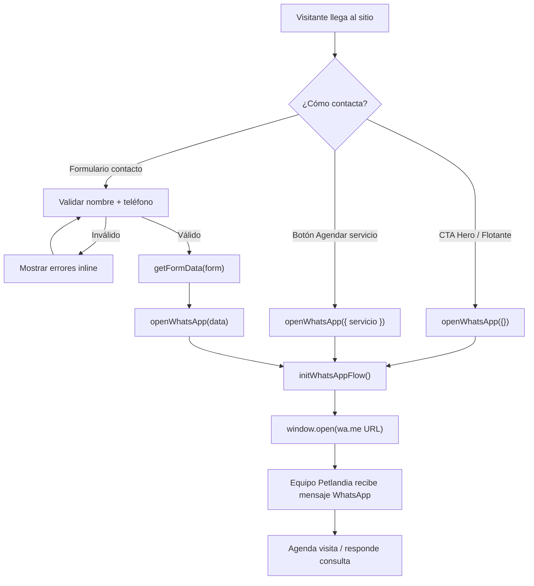
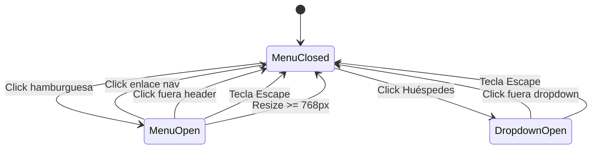
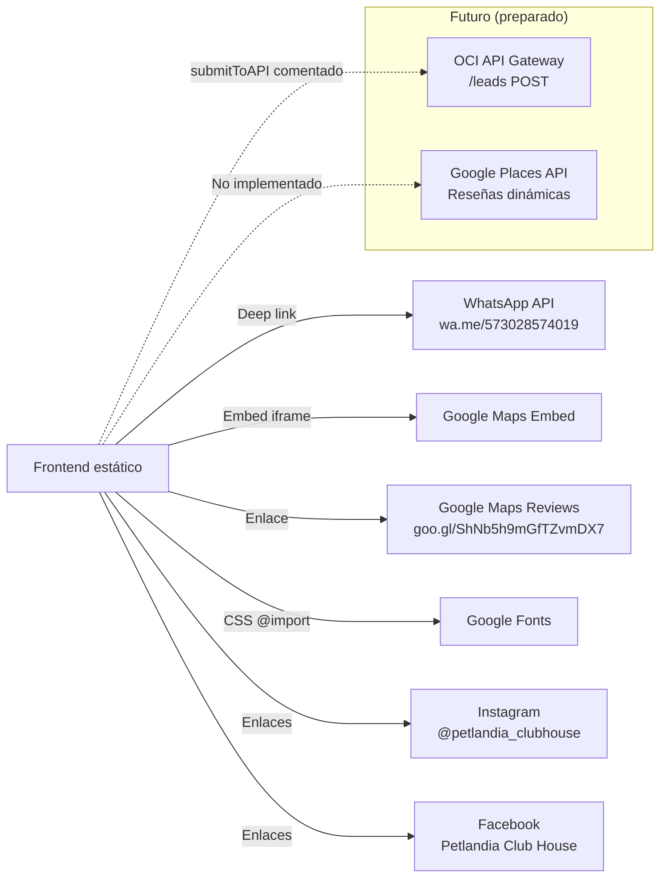

# Club House Petlandia — Documentación de Arquitectura Unificada

> **Versión:** 1.0 · **Última actualización:** mayo 2026  
> **Dominio de producción:** [petlandiaclubhouse.com](https://petlandiaclubhouse.com/)  
> **Patrón arquitectónico:** Sitio estático (JAMstack-lite) · Sin runtime de servidor

Este documento consolida la visión del proyecto, requisitos funcionales y no funcionales, especificaciones técnicas, diagramas de arquitectura en múltiples niveles de abstracción y detalles operativos. Es la referencia única para desarrolladores, operaciones y stakeholders.

---

## Tabla de contenidos

1. [Resumen ejecutivo](#1-resumen-ejecutivo)
2. [Contexto de negocio](#2-contexto-de-negocio)
3. [Requisitos funcionales](#3-requisitos-funcionales)
4. [Requisitos no funcionales](#4-requisitos-no-funcionales)
5. [Arquitectura — Nivel 1: Contexto del sistema (C4)](#5-arquitectura--nivel-1-contexto-del-sistema-c4)
6. [Arquitectura — Nivel 2: Contenedores e infraestructura](#6-arquitectura--nivel-2-contenedores-e-infraestructura)
7. [Arquitectura — Nivel 3: Aplicación frontend](#7-arquitectura--nivel-3-aplicación-frontend)
8. [Arquitectura — Nivel 4: Componentes y módulos](#8-arquitectura--nivel-4-componentes-y-módulos)
9. [Flujos de usuario y datos](#9-flujos-de-usuario-y-datos)
10. [Estructura del repositorio](#10-estructura-del-repositorio)
11. [Especificaciones técnicas detalladas](#11-especificaciones-técnicas-detalladas)
12. [SEO, accesibilidad y datos estructurados](#12-seo-accesibilidad-y-datos-estructurados)
13. [Pipeline CI/CD y operaciones](#13-pipeline-cicd-y-operaciones)
14. [Desarrollo local](#14-desarrollo-local)
15. [Integraciones externas](#15-integraciones-externas)
16. [Roadmap y extensiones futuras](#16-roadmap-y-extensiones-futuras)
17. [Decisiones de arquitectura (ADRs implícitos)](#17-decisiones-de-arquitectura-adrs-implícitos)
18. [Datos de contacto y negocio](#18-datos-de-contacto-y-negocio)

---

## 1. Resumen ejecutivo

**Club House Petlandia** es una landing page estática multisección para un negocio de guardería, hotel y spa para mascotas (perros y gatos) ubicado en Madrid, Cundinamarca, Colombia.

| Atributo | Valor |
|----------|-------|
| **Objetivo principal** | Captar leads y agendar visitas vía WhatsApp |
| **Audiencia** | Dueños de mascotas en Madrid, Cundinamarca y alrededores |
| **Stack** | HTML5 + CSS3 + JavaScript vanilla |
| **Hosting** | OCI Object Storage + Cloudflare CDN |
| **CI/CD** | GitHub Actions (push a `master`) |
| **Coste de infraestructura** | Mínimo (almacenamiento estático + CDN) |
| **Estado** | Producción |

---

## 2. Contexto de negocio

### 2.1 Propuesta de valor

Petlandia ofrece un espacio integral campestre donde las mascotas reciben cuidado profesional, socialización supervisada y bienestar emocional. La web comunica confianza, muestra instalaciones reales y facilita el contacto inmediato.

### 2.2 Servicios del negocio

| Servicio | Descripción breve |
|----------|-------------------|
| **Guardería Canina** | Socialización y juego supervisado, zonas sin jaulas |
| **Guardería Felina** | Espacio separado con doble puerta y gatificación |
| **Plan Pasadía** | Estancia por horas con reporte fotográfico |
| **Grooming y SPA** | Baños, peluquería, corte de uñas, limpieza de oídos |
| **Pet Shop** | Accesorios, snacks y alimentos premium |
| **Paseos** | Paseos grupales o individuales supervisados |
| **Hotel canino** | Hospedaje con camas elevadas y patios interior/exterior |

### 2.3 Páginas del sitio

| Ruta | Propósito | SEO objetivo |
|------|-----------|--------------|
| `/` (`index.html`) | Landing principal con todas las secciones | Hotel y guardería mascotas Madrid |
| `/hotel-canino-madrid/` | Landing SEO dedicada a perros | Hotel canino Madrid Cundinamarca |
| `/guarderia-gatos-madrid/` | Landing SEO dedicada a gatos | Guardería felina Madrid Cundinamarca |

---

## 3. Requisitos funcionales

### RF-01 — Presentación de marca y servicios

| ID | Requisito | Estado |
|----|-----------|--------|
| RF-01.1 | Mostrar hero con imagen de instalaciones, logo y titular SEO | ✅ |
| RF-01.2 | Listar 6 servicios en tarjetas flip interactivas (frente/reverso) | ✅ |
| RF-01.3 | Incluir video autoplay en tarjeta Plan Pasadía | ✅ |
| RF-01.4 | Sección "Por qué elegirnos" con filosofía y 3 pilares | ✅ |
| RF-01.5 | Sección "Conoce nuestros espacios" con descripción y galería | ✅ |

### RF-02 — Galería de clientes

| ID | Requisito | Estado |
|----|-----------|--------|
| RF-02.1 | Galería flip de mascotas (perros) con testimonios en reverso | ✅ |
| RF-02.2 | Placeholder emoji si la imagen no carga (`onerror`) | ✅ |
| RF-02.3 | Galería de gatos (comentada, lista para activar) | 🔶 Deshabilitada |
| RF-02.4 | CTA a Instagram para etiquetar y aparecer en galería | ✅ |

### RF-03 — Reseñas y reputación

| ID | Requisito | Estado |
|----|-----------|--------|
| RF-03.1 | Mostrar reseñas estáticas (copiadas de Google Maps) | ✅ |
| RF-03.2 | Enlace a perfil completo en Google Maps | ✅ |
| RF-03.3 | Carga dinámica vía Google Places API | 🔶 Preparado, no implementado |

### RF-04 — Contacto y conversión (WhatsApp)

| ID | Requisito | Estado |
|----|-----------|--------|
| RF-04.1 | CTA flotante de WhatsApp persistente | ✅ |
| RF-04.2 | CTA WhatsApp en hero | ✅ |
| RF-04.3 | Botón "Agendar" en reverso de cada tarjeta de servicio con mensaje prellenado por servicio | ✅ |
| RF-04.4 | Formulario de lead con campos: nombre, mascota, teléfono, mensaje | ✅ |
| RF-04.5 | Al enviar formulario, abrir WhatsApp con datos estructurados | ✅ |
| RF-04.6 | WhatsApp en footer | ✅ |
| RF-04.7 | Envío de leads a API backend (OCI) | 🔶 Preparado, comentado en código |

### RF-05 — Ubicación y navegación

| ID | Requisito | Estado |
|----|-----------|--------|
| RF-05.1 | Sección "Cómo llegar" con dirección, texto orientativo e iframe Google Maps | ✅ |
| RF-05.2 | Enlace a ruta en Google Maps | ✅ |
| RF-05.3 | Footer con dirección, horarios y redes sociales | ✅ |
| RF-05.4 | Navegación fija con anclas a secciones | ✅ |
| RF-05.5 | Menú desplegable "Huéspedes" → Hotel canino / Guardería felina | ✅ |
| RF-05.6 | Menú hamburguesa responsive en móvil | ✅ |

### RF-06 — Páginas SEO satélite

| ID | Requisito | Estado |
|----|-----------|--------|
| RF-06.1 | Página dedicada hotel canino con contenido long-tail SEO | ✅ |
| RF-06.2 | Página dedicada guardería felina con contenido long-tail SEO | ✅ |
| RF-06.3 | Enlaces cruzados entre páginas satélite y landing principal | ✅ |
| RF-06.4 | CTA WhatsApp específico por página satélite | ✅ |

### RF-07 — Validación de formulario

| ID | Requisito | Estado |
|----|-----------|--------|
| RF-07.1 | Nombre: mínimo 2 caracteres, solo letras y espacios (incluye tildes/ñ) | ✅ |
| RF-07.2 | Teléfono: obligatorio, 10–15 dígitos | ✅ |
| RF-07.3 | Validación en tiempo real (input + blur) | ✅ |
| RF-07.4 | Mensajes de error accesibles (`role="alert"`, `aria-live`) | ✅ |

---

## 4. Requisitos no funcionales

### RNF-01 — Rendimiento

| ID | Requisito | Implementación |
|----|-----------|----------------|
| RNF-01.1 | Sin framework JS (carga mínima) | Vanilla JS, IIFE |
| RNF-01.2 | Imágenes optimizadas WebP con fallback | `<picture>` + PNG/JPEG |
| RNF-01.3 | Lazy loading en imágenes below-the-fold | `loading="lazy"` |
| RNF-01.4 | Prioridad alta en hero | `fetchpriority="high"` |
| RNF-01.5 | CSS crítico inline en `<head>` | Variables + reset inline |
| RNF-01.6 | CDN global vía Cloudflare | Edge caching |
| RNF-01.7 | Script defer | `defer` en `main.js` |

### RNF-02 — Disponibilidad y escalabilidad

| ID | Requisito | Implementación |
|----|-----------|----------------|
| RNF-02.1 | Alta disponibilidad del contenido estático | OCI Object Storage + Cloudflare |
| RNF-02.2 | Escalado horizontal automático | CDN sirve archivos estáticos |
| RNF-02.3 | Invalidación de caché post-deploy | Cloudflare purge API |

### RNF-03 — Seguridad

| ID | Requisito | Implementación |
|----|-----------|----------------|
| RNF-03.1 | Sin backend expuesto | Solo archivos estáticos |
| RNF-03.2 | Secrets en GitHub Actions, no en repo | OCI + Cloudflare secrets |
| RNF-03.3 | Enlaces externos con `rel="noopener noreferrer"` | En todos los `target="_blank"` |
| RNF-03.4 | WhatsApp abre en nueva pestaña con `noopener,noreferrer` | `window.open()` |
| RNF-03.5 | Sin recolección de PII en servidor propio | Datos van directo a WhatsApp |

### RNF-04 — Accesibilidad (a11y)

| ID | Requisito | Implementación |
|----|-----------|----------------|
| RNF-04.1 | Skip link al contenido principal | `.visually-hidden` |
| RNF-04.2 | Navegación con teclado en tarjetas flip | `tabindex="0"`, Enter/Espacio |
| RNF-04.3 | ARIA en menú móvil | `aria-expanded`, `aria-controls`, `aria-label` |
| RNF-04.4 | Cierre con Escape en menú y dropdowns | Event listener `keydown` |
| RNF-04.5 | Respeto a `prefers-reduced-motion` | Media query en CSS |
| RNF-04.6 | Textos alternativos descriptivos en imágenes | Alt con keywords SEO naturales |
| RNF-04.7 | Idioma del documento | `lang="es"` |

### RNF-05 — Responsive design

| ID | Requisito | Breakpoints |
|----|-----------|-------------|
| RNF-05.1 | Mobile-first con ajustes progresivos | Base → 480px → 640px → 768px → 900px → 1024px |
| RNF-05.2 | Menú hamburguesa | `< 768px` |
| RNF-05.3 | Hero full viewport en móvil | `min-height: 100svh` |
| RNF-05.4 | Grids adaptativos | CSS Grid + Flexbox |

### RNF-06 — SEO

| ID | Requisito | Implementación |
|----|-----------|----------------|
| RNF-06.1 | Meta title y description únicos por página | `<head>` por HTML |
| RNF-06.2 | URL canónica | `<link rel="canonical">` |
| RNF-06.3 | Schema.org JSON-LD | `PetBoarding` en home, `WebPage` en satélites |
| RNF-06.4 | Keywords locales (Madrid, Cundinamarca) | Meta + contenido + alt |
| RNF-06.5 | Estructura semántica HTML5 | `<header>`, `<main>`, `<section>`, `<article>`, `<footer>` |

### RNF-07 — Mantenibilidad

| ID | Requisito | Implementación |
|----|-----------|----------------|
| RNF-07.1 | Sin build step obligatorio | Edición directa de HTML/CSS/JS |
| RNF-07.2 | CSS con metodología BEM-like | `.block__element--modifier` |
| RNF-07.3 | JS modularizado en IIFE con API pública | `window.Petlandia` |
| RNF-07.4 | Deploy automatizado | GitHub Actions |

### RNF-08 — Coste operativo

| ID | Requisito | Implementación |
|----|-----------|----------------|
| RNF-08.1 | Infraestructura serverless/estática | OCI bucket + Cloudflare free tier |
| RNF-08.2 | Sin base de datos | N/A |
| RNF-08.3 | Sin contenedores ni VMs | N/A |

---

## 5. Arquitectura — Nivel 1: Contexto del sistema (C4)

Vista de más alto nivel: actores externos, sistema y dependencias.



### Actores

| Actor | Rol |
|-------|-----|
| **Prospecto** | Dueño de mascota que busca servicios, navega la web y contacta |
| **Equipo Petlandia** | Recibe leads por WhatsApp y agenda visitas |
| **Desarrollador** | Mantiene HTML/CSS/JS, dispara deploys vía push a `master` |

---

## 6. Arquitectura — Nivel 2: Contenedores e infraestructura

### 6.1 Diagrama de despliegue



### 6.2 Diagrama de secuencia — Deploy



### 6.3 Resumen operativo (YAML)

```yaml
name: Club House Petlandia Landing
pattern: static_site
runtime: none

repository:
  host: github
  default_branch: master

source_tree:
  entry: index.html
  subpages:
    - hotel-canino-madrid/index.html
    - guarderia-gatos-madrid/index.html
  styles: css/style.css
  scripts: js/main.js
  assets:
    icons: assets/icons/
    gallery: assets/gallery/

delivery_pipeline:
  trigger: push_to_master
  ci: github_actions
  workflow: .github/workflows/deployLanding.yml
  deploy_target:
    provider: oracle_cloud_infrastructure
    service: object_storage
    bucket: petlandia-clubhouse
    namespace: axnplbo9mhwv
  excludes_from_upload:
    - .git/*
    - .github/*
    - README.md
  post_deploy:
    - cloudflare_cache_purge

edge_and_caching:
  provider: cloudflare
  role: dns_proxy_cdn_cache
  cache_invalidation: automated_after_each_deploy

secrets_github_actions:
  oci:
    - OCI_USER_OCID
    - OCI_FINGERPRINT
    - OCI_TENANCY_OCID
    - OCI_REGION
    - OCI_KEY_FILE
  cloudflare:
    - CLOUDFLARE_ZONE_ID
    - CLOUDFLARE_API_TOKEN  # permiso Cache Purge
```

---

## 7. Arquitectura — Nivel 3: Aplicación frontend

### 7.1 Mapa de páginas



### 7.2 Mapa de secciones — Landing principal



---

## 8. Arquitectura — Nivel 4: Componentes y módulos

### 8.1 Diagrama de componentes frontend



### 8.2 Módulo JavaScript — Responsabilidades

| Función / Bloque | Responsabilidad |
|------------------|-----------------|
| `initWhatsAppFlow(data)` | Construye URL `wa.me/{num}?text={encoded}` con campos opcionales |
| `getFormData(form)` | Serializa FormData a objeto JSON plano |
| `validateNombre()` | Regex letras/tildes, min 2 chars |
| `validateTelefono()` | 10–15 dígitos numéricos |
| `validateForm()` | Orquesta validación y muestra errores |
| `showFieldError()` | Toggle `.is-invalid` + mensaje ARIA |
| `openWhatsApp()` | Abre nueva pestaña con URL generada |
| `setMobileMenuOpen()` | Toggle clase `nav-open`, overflow body, ARIA |
| `closeAllNavDetails()` | Cierra dropdowns `<details>` |
| `init()` | Event listeners: menú, form, CTAs, flip cards |
| `window.Petlandia.initWhatsAppFlow` | API exportada para integraciones futuras |

### 8.3 Constantes configurables

| Constante | Ubicación | Valor actual |
|-----------|-----------|--------------|
| `WHATSAPP_NUMBER` | `js/main.js:9` | `573028574019` |
| Puerto local por defecto | `runlocal.ps1` | `5500` |

---

## 9. Flujos de usuario y datos

### 9.1 Flujo principal de conversión



### 9.2 Modelo de datos — Formulario de lead

```json
{
  "nombre": "string, required, min 2, solo letras",
  "mascota": "string, optional",
  "telefono": "string, required, 10-15 dígitos",
  "mensaje": "string, optional"
}
```

**Nota:** El campo `email` está soportado en `initWhatsAppFlow()` pero no expuesto en el formulario HTML actual.

### 9.3 Mensaje WhatsApp generado (ejemplo)

```
¡Hola!
Quiero agendar: Guardería Canina
Nombre: María García
Nombre de mi mascota: Luna
Teléfono: 3001234567
Mensaje: Quisiera visita el sábado
```

### 9.4 Flujo de navegación móvil



---

## 10. Estructura del repositorio

```
PetlandiaLandingPage/
├── index.html                      # Landing principal
├── hotel-canino-madrid/
│   └── index.html                  # Página SEO hotel canino
├── guarderia-gatos-madrid/
│   └── index.html                  # Página SEO guardería felina
├── css/
│   └── style.css                   # Estilos globales (~1955 líneas)
├── js/
│   └── main.js                     # Lógica cliente (IIFE)
├── assets/
│   ├── icons/                      # SVG: whatsapp, instagram, facebook, paw
│   └── gallery/                    # Imágenes WebP/PNG/JPEG, video Pasadia.mp4
├── .github/
│   └── workflows/
│       └── deployLanding.yml       # CI/CD OCI + Cloudflare
├── runlocal.ps1                    # Servidor local Python
├── runlocal.bat                    # Wrapper Windows
├── README.md                       # Guía rápida
├── ARQUITECTURA.md                 # Este documento
└── .gitignore
```

---

## 11. Especificaciones técnicas detalladas

### 11.1 Stack tecnológico

| Capa | Tecnología | Versión / Notas |
|------|------------|-----------------|
| Markup | HTML5 | Semántico, `lang="es"` |
| Estilos | CSS3 | Variables, Grid, Flexbox, `@media`, `@keyframes` |
| Script | JavaScript ES6+ | Strict mode, IIFE, sin transpilación |
| Fuentes | Google Fonts | Quicksand (500–700), Roboto Rounded (300–500) |
| Servidor local | Python `http.server` | Puerto 5500 por defecto |
| CI | GitHub Actions | `ubuntu-latest` |
| OCI CLI Action | `oracle-actions/run-oci-cli-command@v1.3.2` | bulk-upload |
| CDN | Cloudflare | purge_everything post-deploy |

### 11.2 Paleta de diseño (PetlandiaStyle)

| Token CSS | Valor | Uso |
|-----------|-------|-----|
| `--background-base` | `#E0F7FA` | Fondo principal |
| `--background-accent` | `#00E5FF` | Acentos |
| `--pop-pink` | `#FF1493` | Borde header, CTAs |
| `--pop-orange` | `#FF8C00` | Acentos cálidos |
| `--pop-lila` | `#E6E6FA` | Gradientes |
| `--pop-mint` | `#98FF98` | Gradientes |
| `--deep-purple` | `#4B0082` | Contraste |
| `--dark-text` | `#008080` | Texto principal (teal) |
| `--text-primary` | `#FFFFFF` | Texto sobre fondos oscuros |

### 11.3 Breakpoints responsive

| Breakpoint | Uso principal |
|------------|---------------|
| `max-width: 380px` | Ajustes extra-small |
| `max-width: 767px` | Vista móvil completa |
| `min-width: 480px` | Grids iniciales |
| `min-width: 640px` | Galerías 2 columnas |
| `min-width: 768px` | Nav desktop, menú hamburguesa off |
| `min-width: 900px` | Layouts amplios |
| `min-width: 1024px` | Desktop full |

### 11.4 Componentes UI interactivos

| Componente | Clase CSS | Interacción |
|------------|-----------|-------------|
| Tarjeta servicio | `.card-flip` | Click / Enter / Espacio → flip |
| Tarjeta galería | `.gallery-flip` | Click / Enter / Espacio → flip |
| Botón agendar | `.btn-agendar` | Click → WhatsApp con `data-servicio` |
| Menú móvil | `.header__menu-btn` | Toggle `.nav-open` |
| Dropdown Huéspedes | `.nav__details` | `<details>/<summary>` nativo |
| CTA flotante | `.floating-cta` | Fixed, WhatsApp |
| Formulario | `.form` | Validación + submit → WhatsApp |

### 11.5 Assets multimedia

| Tipo | Formato preferido | Fallback | Optimización |
|------|-------------------|----------|--------------|
| Fotos | WebP | PNG / JPEG | `<picture>` |
| Hero | WebP | PNG | `fetchpriority="high"` |
| Video Plan Pasadía | MP4 | — | `muted loop playsinline autoplay` |
| Iconos | SVG | — | Inline en `/assets/icons/` |
| Logo | PNG | — | Header + favicon |

---

## 12. SEO, accesibilidad y datos estructurados

### 12.1 Schema.org — Landing principal

```json
{
  "@type": "PetBoarding",
  "name": "Club House Petlandia",
  "telephone": "+573028574019",
  "address": {
    "streetAddress": "Lorena Echavarria, Cra. 11 #7- 85",
    "addressLocality": "Madrid",
    "addressRegion": "Cundinamarca",
    "addressCountry": "CO"
  },
  "geo": {
    "latitude": 4.7356368,
    "longitude": -74.2669698
  },
  "openingHoursSpecification": {
    "dayOfWeek": ["Monday"–"Sunday"],
    "opens": "08:00",
    "closes": "18:00"
  }
}
```

### 12.2 Keywords objetivo por página

| Página | Keywords principales |
|--------|---------------------|
| Home | hotel canino, guardería perros/gatos, spa mascotas, Madrid Cundinamarca |
| Hotel canino | hotel canino Madrid, guardería perros, hospedaje mascotas |
| Guardería felina | guardería gatos Madrid, hotel felino, gatificación |

### 12.3 Checklist SEO implementado

- [x] Title y meta description únicos
- [x] Canonical URL
- [x] JSON-LD structured data
- [x] Alt text descriptivo con geo-keywords
- [x] Enlaces internos entre páginas satélite
- [x] Enlace a Google Maps / reseñas
- [x] Contenido long-tail en subpáginas
- [ ] Sitemap.xml (pendiente)
- [ ] robots.txt (pendiente)

---

## 13. Pipeline CI/CD y operaciones

### 13.1 Workflow `deployLanding.yml`

```yaml
trigger: push → branch master
steps:
  1. checkout@v4
  2. OCI bulk-upload:
     - namespace: axnplbo9mhwv
     - bucket: petlandia-clubhouse
     - src-dir: ./
     - exclude: .git/*, .github/*, README.md
     - content-type: auto
     - overwrite: true
  3. Cloudflare purge_cache (purge_everything: true)
```

### 13.2 Archivos excluidos del deploy

| Excluido | Razón |
|----------|-------|
| `.git/*` | Metadatos Git |
| `.github/*` | Workflows CI (no necesarios en bucket) |
| `README.md` | Documentación dev (no pública) |

**Nota:** `ARQUITECTURA.md`, `runlocal.*` y `.vscode/` sí se suben al bucket salvo que se añadan exclusiones futuras.

### 13.3 Rollback

No hay rollback automatizado. Estrategia manual:

1. Revertir commit en GitHub
2. Push a `master` → redeploy automático
3. Cloudflare purge incluido en pipeline

---

## 14. Desarrollo local

### 14.1 Requisitos

- Python 3 en PATH (`python` o `py`)
- PowerShell o CMD (Windows)

### 14.2 Comandos

```powershell
# Puerto por defecto 5500
.\runlocal.bat

# Puerto personalizado
.\runlocal.bat 8080
```

Equivalente directo:

```powershell
python -m http.server 5500
```

### 14.3 URLs locales

| Página | URL |
|--------|-----|
| Home | http://localhost:5500/ |
| Hotel canino | http://localhost:5500/hotel-canino-madrid/ |
| Guardería felina | http://localhost:5500/guarderia-gatos-madrid/ |

---

## 15. Integraciones externas



| Integración | Tipo | Datos intercambiados | Estado |
|-------------|------|---------------------|--------|
| WhatsApp | Deep link | Mensaje prellenado (PII del usuario) | ✅ Activo |
| Google Maps Embed | iframe | Solo visualización | ✅ Activo |
| Google Maps Reviews | Enlace externo | N/A | ✅ Activo |
| Google Fonts | CDN CSS | IP del visitante | ✅ Activo |
| Instagram / Facebook | Enlaces | N/A | ✅ Activo |
| Google Places API | REST (futuro) | Reseñas, rating | 🔶 Planificado |
| OCI API Gateway | REST (futuro) | JSON lead form | 🔶 Planificado |

---

## 16. Roadmap y extensiones futuras

| Prioridad | Feature | Detalle técnico |
|-----------|---------|-----------------|
| Media | API de leads | Descomentar `submitToAPI()` en `main.js`, endpoint OCI Function/API Gateway |
| Media | Reseñas dinámicas | Google Places API + Place ID, render en `#reviews-container` |
| Baja | Galería gatos | Descomentar bloque HTML en `#galeria` |
| Baja | Sitemap + robots.txt | Generación estática o script pre-deploy |
| Baja | Analytics | Google Analytics 4 o Plausible (script en `<head>`) |
| Baja | Excluir docs del deploy | Añadir `ARQUITECTURA.md`, `runlocal.*` a `--exclude` |
| Baja | Campo email en formulario | Ya soportado en JS, falta input HTML |
| Baja | PWA / Service Worker | Offline cache para visitas repetidas |

---

## 17. Decisiones de arquitectura (ADRs implícitos)

### ADR-001: Sitio estático sin framework

**Contexto:** Landing de marketing con contenido mayormente estático.  
**Decisión:** HTML/CSS/JS vanilla, sin React/Vue/build step.  
**Consecuencias:** (+) Simplicidad, coste mínimo, deploy directo. (−) Duplicación de header/footer en subpáginas.

### ADR-002: WhatsApp como CRM de conversión

**Contexto:** El negocio opera agendamiento por chat.  
**Decisión:** Todos los CTAs convergen a WhatsApp con mensaje prellenado.  
**Consecuencias:** (+) Cero backend para leads. (−) Sin analytics de conversión en servidor propio.

### ADR-003: OCI Object Storage + Cloudflare

**Contexto:** Necesidad de hosting económico con CDN global.  
**Decisión:** Bucket OCI como origen, Cloudflare como edge.  
**Consecuencias:** (+) Alta disponibilidad, purge automatizado. (−) Dependencia de dos proveedores cloud.

### ADR-004: Páginas satélite SEO en lugar de SPA

**Contexto:** Necesidad de ranking para keywords específicos (hotel canino, guardería gatos).  
**Decisión:** HTML independientes con contenido long-tail.  
**Consecuencias:** (+) SEO nativo, URLs limpias. (−) Mantener navegación sincronizada manualmente.

### ADR-005: Flip cards CSS + JS mínimo

**Contexto:** Mostrar más información sin navegar a otra página.  
**Decisión:** Tarjetas flip con CSS transform + toggle de clase JS.  
**Consecuencias:** (+) Interactividad sin librerías. (−) Contenido del reverso no indexado igual que visible hasta flip.

---

## 18. Datos de contacto y negocio

| Campo | Valor |
|-------|-------|
| **Nombre comercial** | Club House Petlandia |
| **Dirección** | Lorena Echavarria, Cra. 11 #7- 85, Madrid, Cundinamarca, Colombia |
| **Coordenadas** | 4.7356368, -74.2669698 |
| **Teléfono / WhatsApp** | +57 302 857 4019 |
| **Horario** | Lun – Dom, 8:00 – 18:00 |
| **Instagram** | [@petlandia_clubhouse](https://www.instagram.com/petlandia_clubhouse) |
| **Facebook** | [Petlandia Club House](https://www.facebook.com/p/Petlandia-Club-House-61572618735484/) |
| **Google Maps** | [Ver en Maps](https://maps.app.goo.gl/ShNb5h9mGfTZvmDX7) |
| **Dominio** | petlandiaclubhouse.com |

---

## Apéndice A — Historial evolutivo del proyecto

| Commit / Fase | Cambio relevante |
|---------------|------------------|
| Deploy inicial | Sync a OCI Object Storage vía GitHub Actions |
| Optimización CSS | Mejoras responsive y PetlandiaStyle |
| Cache automation | Purge Cloudflare post-deploy (#2, #3) |
| Ubicación precisa | Sección "Cómo llegar" + iframe Maps |
| Páginas satélite | `/hotel-canino-madrid/` y `/guarderia-gatos-madrid/` |
| Dev local | Scripts `runlocal.ps1` / `runlocal.bat` |
| Workflow fix | YAML camelCase (`deployLanding.yml`) |

---

## Apéndice B — Glosario

| Término | Definición |
|---------|------------|
| **Lead** | Prospecto que completa formulario o contacta por WhatsApp |
| **Flip card** | Tarjeta con animación 3D que muestra reverso al interactuar |
| **Página satélite** | Subpágina SEO independiente enlazada desde nav principal |
| **Gatificación** | Diseño de espacios optimizado para bienestar felino |
| **Plan Pasadía** | Servicio de estancia por horas (day pass) |
| **PetlandiaStyle** | Sistema de diseño visual con paleta pop y tipografía redondeada |

---

*Documento generado como referencia arquitectónica unificada del repositorio PetlandiaLandingPage.*
