# VibeWindows — Documentación unificada del proyecto

**Versión de producto:** `0.2.2` (`WUI/VERSION`)  
**Última actualización:** 2026-05-20  
**Alcance:** repositorio completo (`WUI/`, `PyHands/`, `python/`)

Este documento **consolida** arquitectura, requisitos, especificaciones, contratos, roadmap y trazabilidad en un solo lugar. Los archivos [`README.md`](../../README.md), [`ARQUITECTURA.md`](ARQUITECTURA.md), [`VISION_E_IDEAS.md`](../../VISION_E_IDEAS.md) y [`MVP_CHECKLIST.md`](../../MVP_CHECKLIST.md) siguen existiendo; aquí están **resumidos y enlazados** para evitar fragmentación.

---

## Tabla de contenidos

1. [Resumen ejecutivo](#1-resumen-ejecutivo)
2. [Requisitos funcionales](#2-requisitos-funcionales)
3. [Requisitos no funcionales](#3-requisitos-no-funcionales)
4. [Estado del producto y fases](#4-estado-del-producto-y-fases)
5. [Diagramas — Nivel 0 (contexto C4)](#5-diagramas--nivel-0-contexto-c4)
6. [Diagramas — Nivel 1 (contenedores y procesos)](#6-diagramas--nivel-1-contenedores-y-procesos)
7. [Diagramas — Nivel 2 (capas WUI)](#7-diagramas--nivel-2-capas-wui)
8. [Diagramas — Nivel 3 (dominio visión)](#8-diagramas--nivel-3-dominio-visión)
9. [Diagramas — Nivel 4 (gestos, entrada, seguridad)](#9-diagramas--nivel-4-gestos-entrada-seguridad)
10. [Diagramas — Nivel 5 (secuencias)](#10-diagramas--nivel-5-secuencias)
11. [Diagramas — Producto y roadmap (escalones)](#11-diagramas--producto-y-roadmap-escalones)
12. [Diagramas — Despliegue y coexistencia](#12-diagramas--despliegue-y-coexistencia)
13. [Especificaciones técnicas](#13-especificaciones-técnicas)
14. [Contratos entre subsistemas](#14-contratos-entre-subsistemas)
15. [Inventario de componentes](#15-inventario-de-componentes)
16. [Trazabilidad MVP](#16-trazabilidad-mvp)
17. [Diagnóstico y mejoras](#17-diagnóstico-y-mejoras)
18. [Referencias](#18-referencias)

---

## 1. Resumen ejecutivo

**VibeWindows** es una aplicación **WPF (.NET 8)** para Windows que:

1. Captura vídeo de una **webcam** (local con OpenCvSharp o delegada al servidor Python).
2. Infiere **landmarks de mano** (ONNX en proceso o MediaPipe Tasks vía TCP).
3. Opcionalmente **controla el cursor** del escritorio virtual mediante gestos de mano.
4. Ofrece una **vista de depuración tipo Kinect** (vídeo, overlay, métricas, mapa multi-monitor).

**Objetivo de producto (largo plazo):** usar PC principalmente con **cámara y micrófono**, sin cerrar la puerta a otras apps que también necesiten visión — mediante captura única, redistribución interna y (futuro) cámara virtual.

**Hito actual:** **Fase 1 / MVP núcleo** — pipeline captura + inferencia real + gestos básicos + seguridad de inyección + vista Kinect. Pendiente validación formal **M5** (1 y 2 monitores).

**Flujo lógico unificado:**

```
Cámara → CaptureBroker / CameraOwner → VisionSession → IVisionEngine → VisionResult
                                                              ↓
                                                    GesturePolicy → PointerDriver
                                                              ↓
                                                    InjectionSafety (OFF por defecto)
```

**Principios de diseño implementados:**

| Principio | Implementación |
|-----------|----------------|
| Contrato único de salida | `VisionResult` / `HandState` — todos los motores convergen aquí |
| Separación visión / gesto | `IVisionEngine` no conoce el ratón; `GesturePolicy` no conoce ONNX |
| Seguridad por defecto | `InjectionSafety` OFF; rescate Ctrl+Shift+E + ratón físico |
| Latencia controlada | Colas tamaño 1, `DropOldest`, stride de inferencia, buffer cámara 1 |
| Degradación elegante | Factory: Python → Float ONNX → Zoo ONNX → `StubVisionEngine` |
| Configuración centralizada | `VisionConfig` (`Configuration/VisionConfig.cs`) |

---

## 2. Requisitos funcionales

Identificadores **RF-xxx** para trazabilidad con issues y checklist.

### 2.1 Interfaz de usuario

| ID | Requisito | Estado | Componentes |
|----|-----------|--------|-------------|
| RF-UI-01 | Ventana principal con estado del motor de visión y versión | ✅ | `MainWindow` |
| RF-UI-02 | Indicador claro cuando la inyección de ratón está **desactivada** | ✅ | `InjectionSafety`, UI |
| RF-UI-03 | Selector de cámara (WinRT + sonda OpenCV o `list_cameras` Python) | ✅ | `CameraEnumerator` |
| RF-UI-04 | Botón **Actualizar lista** de cámaras sin bloquear UI | ✅ | Enumeración en background |
| RF-UI-05 | Ventana **vista Kinect** (fondo oscuro, vídeo, métricas) | ✅ | `KinectPreviewWindow` |
| RF-UI-06 | Toggle **«Ver detecciones»** (solo capa UI, no altera passthrough) | ✅ | Overlay en Kinect |
| RF-UI-07 | Mapa de monitores, punto cursor/mano, **Recalibrar alcance** | ✅ v0.2.2 | `VirtualDesktopLayout`, calibrador |
| RF-UI-08 | Tema Solarized Light | ✅ | `Themes/SolarizedLight.xaml` |
| RF-UI-09 | Cierre ordenado sin procesos zombi ni cámara bloqueada | ✅ | `Release()` en capture |

### 2.2 Captura y visión

| ID | Requisito | Estado | Componentes |
|----|-----------|--------|-------------|
| RF-VIS-01 | Contrato estable `IVisionEngine` → `VisionResult` | ✅ | `Vision/IVisionEngine.cs` |
| RF-VIS-02 | Motor ONNX Zoo (palma + pose, OpenCV Zoo) | ✅ | `MediapipeHandOnnxEngine` |
| RF-VIS-03 | Motor ONNX Float QAIRT (detector + landmarks) | ✅ | `MediapipeFloatHandOnnxEngine` |
| RF-VIS-04 | Motor Python por TCP (landmarks + preview JPEG) | ✅ | `PythonSocketVisionEngine` |
| RF-VIS-05 | Fallback a stub (0 manos) si falla carga de modelos | ✅ | `StubVisionEngine` |
| RF-VIS-06 | Medición FPS captura e inferencia en UI | ✅ | `VisionSession`, métricas |
| RF-VIS-07 | Captura única multiplexada (`CaptureBroker`) | ✅ v0.2+ | `CaptureBroker`, sinks |
| RF-VIS-08 | Watchdog reconexión Python (`camera_lost`) | ✅ v0.2+ | `VisionServerControlClient` |
| RF-VIS-09 | Cámara virtual **VibeVirtualCam** hacia apps externas | ⏳ | `LatestFrameBufferSink` listo; driver pendiente |

### 2.3 Gestos y puntero

| ID | Requisito | Estado | Detalle |
|----|-----------|--------|---------|
| RF-GES-01 | Mover cursor con **índice + medio extendidos** (ancla anular+meñique) | ✅ | `GesturePolicy` |
| RF-GES-02 | Clic izquierdo: **pulgar → índice** (anillo, con histéresis) | ✅ | `PinchDragClickController` |
| RF-GES-03 | Clic derecho: **pulgar → medio** | ✅ | Umbrales `VIBE_GESTURE_THUMB_RING_*` |
| RF-GES-04 | Solo **palma hacia cámara** (configurable) | ✅ | `PalmOrientationValidator` |
| RF-GES-05 | Mapeo a **escritorio virtual** multi-monitor | ✅ v0.2.2 | `PointerDriver`, `VirtualDesktopLayout` |
| RF-GES-06 | Calibración de alcance XY y compensación de lejanía | ✅ v0.2.2 | `HandReachCalibrator` |
| RF-GES-07 | Suavizado adaptativo del puntero | ✅ v0.2.2 | `AdaptivePointerSmoother` |
| RF-GES-08 | Gestos de ventana (minimizar, etc.) | ❌ | `GesturePreferences.WindowGesturesEnabled` reservado |
| RF-GES-09 | Voz / STT | ❌ | Fase C (roadmap) |
| RF-GES-10 | Lengua de señas | ❌ | Fase D (roadmap) |

### 2.4 Seguridad de entrada

| ID | Requisito | Estado | Componentes |
|----|-----------|--------|-------------|
| RF-SEC-01 | Inyección de ratón **OFF** al arranque | ✅ | `InjectionSafety` |
| RF-SEC-02 | Activación voluntaria por el usuario en UI | ✅ | Checkbox principal |
| RF-SEC-03 | Todas las rutas `SendInput` respetan el flag | ✅ | `PointerDriver`, `Win32InputInjector` |
| RF-SEC-04 | Parada de emergencia **Ctrl+Shift+E** | ✅ | `EmergencyHotkeyRegistration` |
| RF-SEC-05 | Ratón físico desactiva inyección al moverse | ✅ | `PhysicalMouseInputWatcher` |
| RF-SEC-06 | Movimiento sintético no cuenta como físico | ✅ | `SyntheticInputTracker` |

### 2.5 Integración Python

| ID | Requisito | Estado | Detalle |
|----|-----------|--------|---------|
| RF-PY-01 | Servidor TCP datos **:5757** y control **:5758** | ✅ | `python/vision_server.py` |
| RF-PY-02 | Esquema wire `schema_version=1` alineado C#/Python | ✅ | `HandFrameDto`, `wire_schema.py` |
| RF-PY-03 | Sin doble apertura de cámara con `VIBE_VISION_PYTHON=1` | ✅ | `PythonDelegatedCameraSource` |
| RF-PY-04 | CLI standalone PyHands (`python -m pyhands`) | ✅ | `PyHands/` |

---

## 3. Requisitos no funcionales

### 3.1 Rendimiento

| ID | Requisito | Objetivo / medida | Medios |
|----|-----------|-------------------|--------|
| RNF-PERF-01 | Latencia mano → cursor perceptible | Cola 1, inferencia paralela opcional | `VisionSession`, canal `DropOldest` |
| RNF-PERF-02 | Carga CPU acotable | Stride inferencia, ancho máx. análisis | `VIBE_VISION_INFER_STRIDE`, `VIBE_VISION_MAX_WIDTH` |
| RNF-PERF-03 | GPU opcional para ONNX | DirectML si disponible | `VIBE_ONNX_EP=DML` |
| RNF-PERF-04 | Arranque UI sin bloqueo largo | Enumeración cámara tras `ApplicationIdle` | `MainWindow` |
| RNF-PERF-05 | Arranque con Python sin sonda OpenCV 0…N | `list_cameras` por control | v0.2.1+ |

### 3.2 Fiabilidad y disponibilidad

| ID | Requisito | Medios |
|----|-----------|--------|
| RNF-REL-01 | Degradación sin modelos (stub + mensaje UI/log) | `VisionEngineFactory` |
| RNF-REL-02 | Reintentos ante pérdida cámara Python | `VIBE_PY_WATCHDOG_*` |
| RNF-REL-03 | Liberación explícita `VideoCapture` al parar | `finally` en bucle captura |
| RNF-REL-04 | Log persistente de errores | `%TEMP%\VibeWindows.log` (`AppLog`) |

### 3.3 Seguridad y privacidad

| ID | Requisito | Medios |
|----|-----------|--------|
| RNF-SEC-01 | Inyección desactivada por defecto | `InjectionSafety` |
| RNF-SEC-02 | Procesamiento local de vídeo (sin nube obligatoria) | ONNX / Python local |
| RNF-SEC-03 | Indicador claro de modo inyección activa | UI + rescate |
| RNF-SEC-04 | Sin telemetría cloud por defecto | Diseño actual |

### 3.4 Mantenibilidad y pruebas

| ID | Requisito | Medios |
|----|-----------|--------|
| RNF-MAINT-01 | Config central `VisionConfig` | Una fuente de defaults `VIBE_*` |
| RNF-MAINT-02 | Motores intercambiables vía factory | `VisionEngineKind` |
| RNF-MAINT-03 | Tests automatizados ONNX y gesto | `WUI/tests/VibeWindows.Tests/` |
| RNF-MAINT-04 | DI opcional en `VisionSession` | Tests con inyectores grabadores |

### 3.5 Compatibilidad

| ID | Requisito | Detalle |
|----|-----------|---------|
| RNF-COMP-01 | Windows 10/11 x64 | Target `net8.0-windows10.0.17763.0` |
| RNF-COMP-02 | .NET 8 SDK | Build desde `WUI/VibeWindows.sln` |
| RNF-COMP-03 | Webcam USB / virtual (OBS) | MSMF/DSHOW, gaps de sonda |
| RNF-COMP-04 | Escritorio virtual multi-monitor | `EnumDisplayMonitors` |

### 3.6 Usabilidad

| ID | Requisito | Detalle |
|----|-----------|---------|
| RNF-UX-01 | Perfil distancia cercana documentado | `WUI/profile-cerca.ps1` |
| RNF-UX-02 | Mensajes de error con ruta al log | `App` global handlers |
| RNF-UX-03 | Documentación operativa (build, env, OBS) | `README.md` |

---

## 4. Estado del producto y fases

### 4.1 Fases de producto (VISION_E_IDEAS)

| Fase | Contenido | Estado |
|------|-----------|--------|
| **A — MVP** | Captura, landmarks, cursor, clic, vista Kinect | **En curso** (~95 % checklist) |
| **B — Robustez** | Calibración, perfiles, multi-monitor, kill switch | **Parcial** (calibración, M5 pendiente) |
| **C — Voz** | Dictado / comandos | No iniciado |
| **D — Lengua de señas** | Secuencias temporales | No iniciado |
| **E — Agente + pantalla** | Contexto, `ActionGate` | No iniciado |

### 4.2 Escalones arquitectónicos (mapa incremental)

| Escalón | Alineado | Estado |
|---------|----------|--------|
| 0 — Esqueleto | Pre-MVP | ✅ |
| 1 — MVP núcleo | Fase A | ✅ |
| 2 — Retransmisión / VirtualCam | Fase A+ | ⏳ broker + buffer; falta driver |
| 3 — Robustez producto | Fase B | ⏳ |
| 4–8 | Voz, orquestador, señas, agente, plugins | ❌ |

### 4.3 Motores de visión (selección automática)

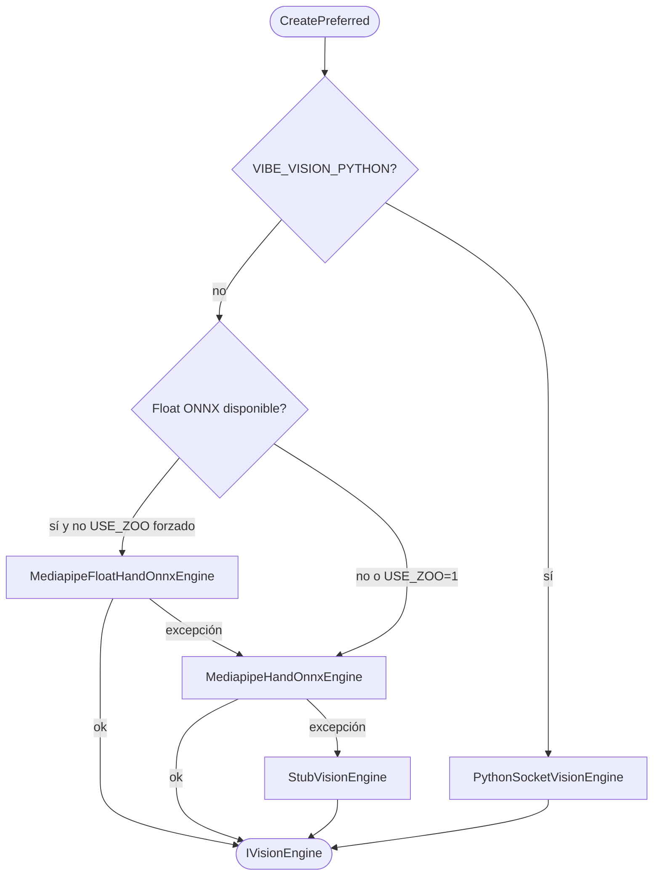

| `VisionEngineKind` | Cuándo |
|--------------------|--------|
| `PythonSocket` | `VIBE_VISION_PYTHON=1` |
| `OnnxFloat` | `hand_detector.onnx` + `hand_landmark_detector.onnx` |
| `OnnxZoo` | Float falla o `VIBE_VISION_USE_ZOO=1` |
| `Stub` | Sin modelos o error de carga |

---

## 5. Diagramas — Nivel 0 (contexto C4)

Actores externos y sistemas colindantes.

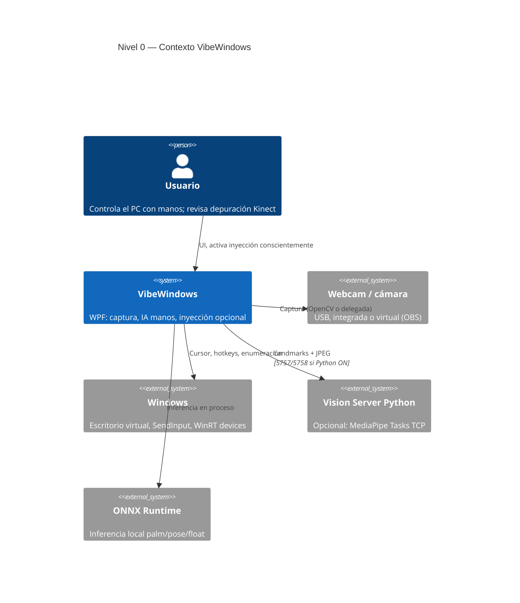

---

## 6. Diagramas — Nivel 1 (contenedores y procesos)

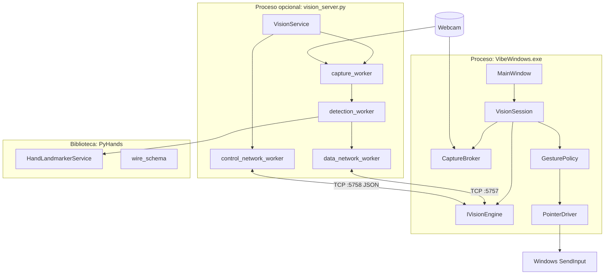

| Contenedor | Ruta | Responsabilidad |
|------------|------|-----------------|
| **WUI** | `WUI/src/VibeWindows/` | App WPF, orquestación, gestos, seguridad |
| **Tests** | `WUI/tests/VibeWindows.Tests/` | Unit + integración ONNX / fotos |
| **vision_server** | `python/vision_server.py` | Servidor multi-hilo TCP |
| **PyHands** | `PyHands/pyhands/` | MediaPipe Tasks + wire + CLI |

---

## 7. Diagramas — Nivel 2 (capas WUI)

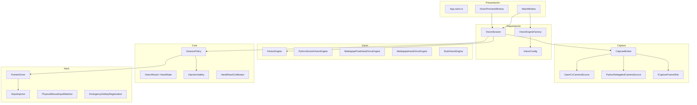

**Regla de dependencia:** `Presentación → Orquestación → (Captura | Visión | Core | Input)`; **Visión no referencia Input**.

---

## 8. Diagramas — Nivel 3 (dominio visión)

### 8.1 Clases (contrato e implementaciones)

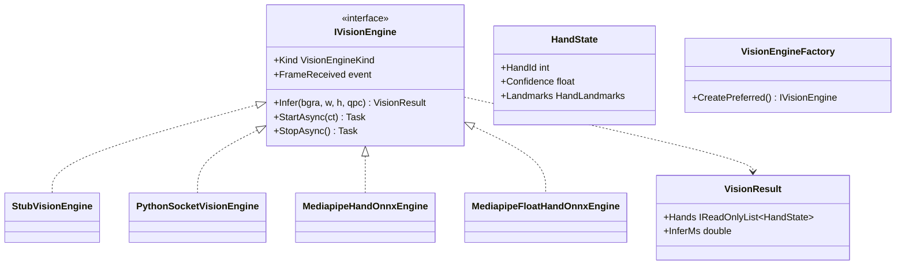

### 8.2 Pipeline ONNX Zoo

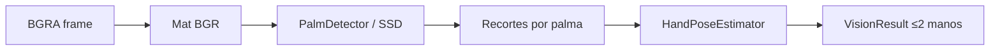

### 8.3 Pipeline ONNX Float (QAIRT)

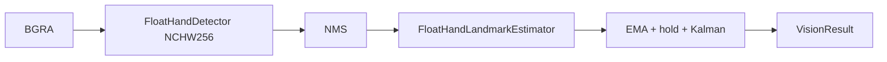

### 8.4 Captura multiplexada

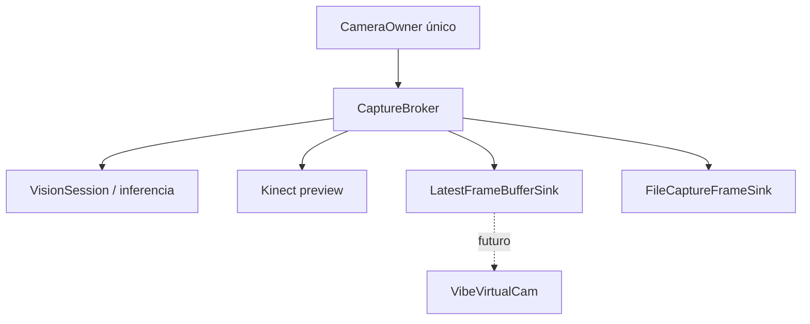

---

## 9. Diagramas — Nivel 4 (gestos, entrada, seguridad)

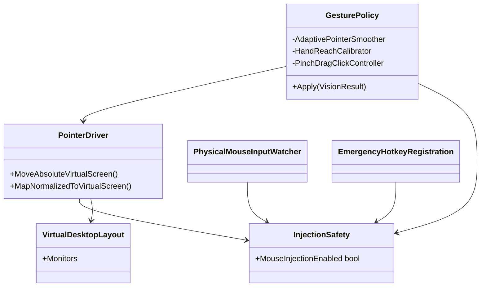

### 9.1 Máquina de estados — interacción (conceptual)

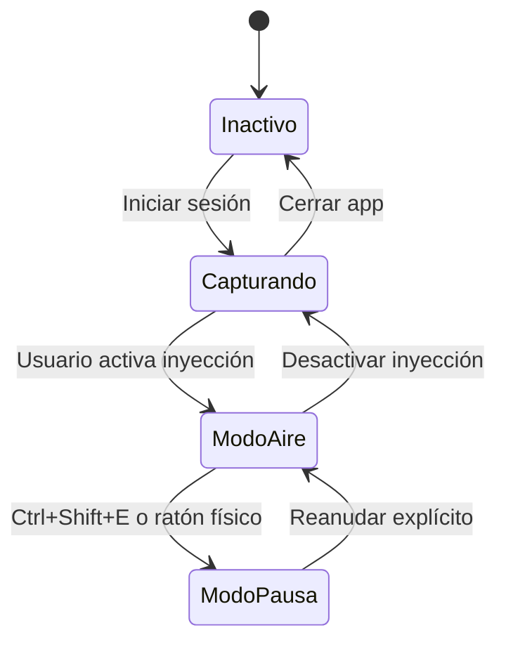

### 9.2 Especificación de gestos (Fase 1)

| Gesto | Condición | Acción |
|-------|-----------|--------|
| **Puntero** | Palma a cámara + índice y medio extendidos | Mueve cursor (landmark 8 suavizado) |
| **Clic izq.** | Pulgar toca índice (anillo, hold frames) | `SendInput` botón izquierdo |
| **Clic der.** | Pulgar toca medio | `SendInput` botón derecho |
| **Arrastre** | Pinza sostenida (controller interno) | Drag según política |

Variables principales: grupo `VIBE_GESTURE_*` en [`README.md`](../../README.md) y `VisionConfig.Gesture`.

---

## 10. Diagramas — Nivel 5 (secuencias)

### 10.1 Modo local: captura + inferencia

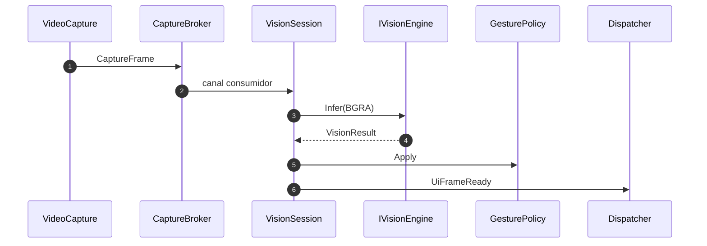

### 10.2 Modo Python

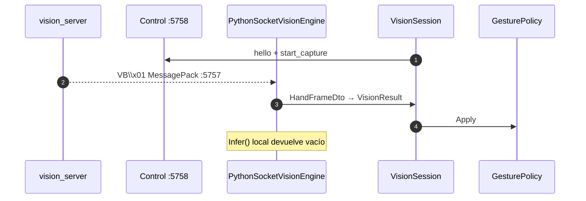

### 10.3 Arranque aplicación

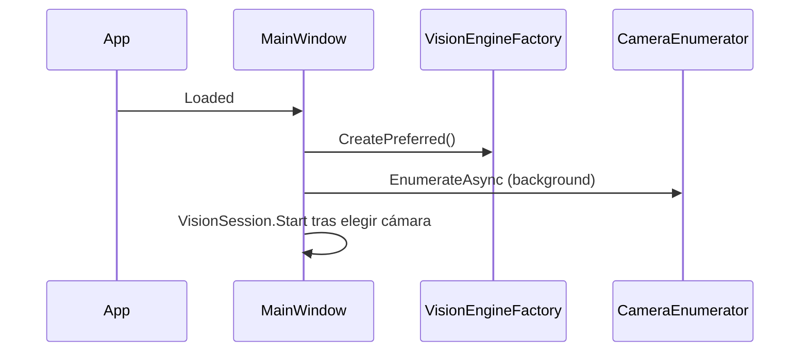

---

## 11. Diagramas — Producto y roadmap (escalones)

### 11.1 Escalón 1 — MVP núcleo (actual)

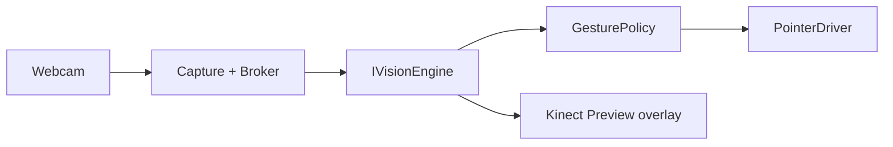

### 11.2 Escalón 2 — Retransmisión limpia (objetivo)

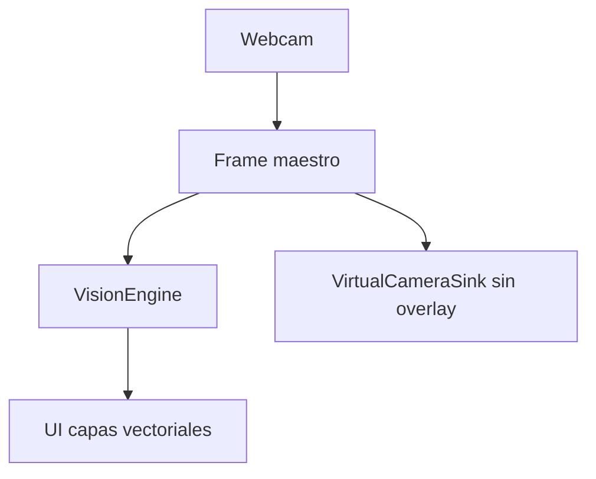

### 11.3 Escalones 4–7 (futuro)

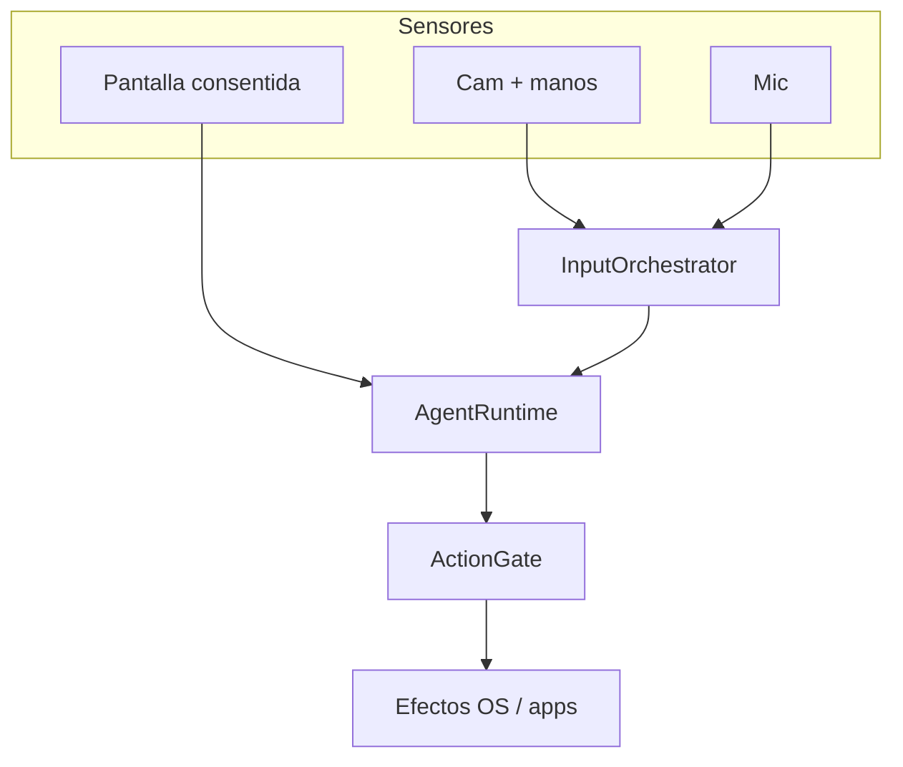

---

## 12. Diagramas — Despliegue y coexistencia

### 12.1 MVP: proceso único

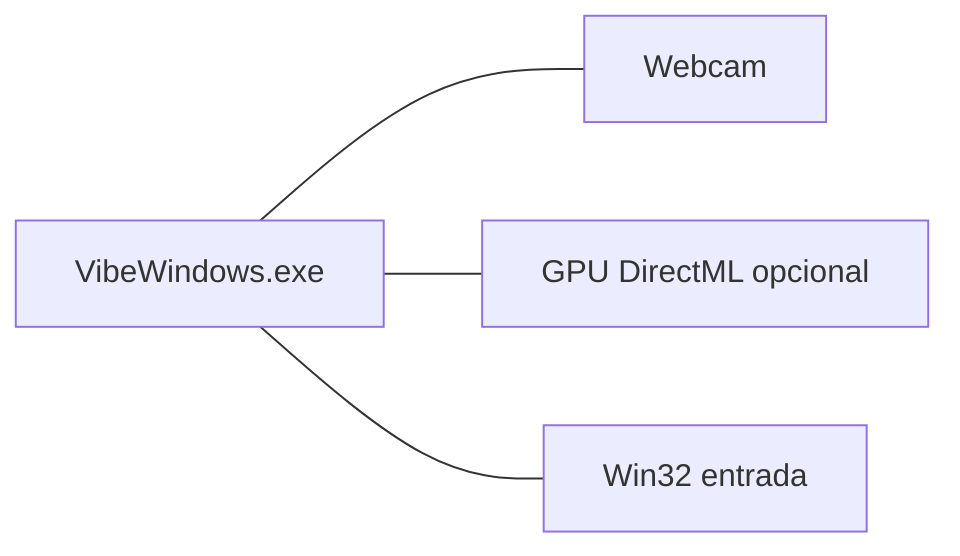

### 12.2 Coexistencia con terceros (objetivo)

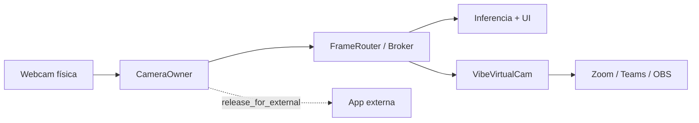

| Estrategia | ID | Estado |
|------------|-----|--------|
| A — Cámara virtual limpia | Coexist-A | ⏳ |
| B — Cesión cooperativa `release_for_external` | Coexist-B | ⏳ |
| C — API local landmarks (token) | Coexist-C | ⏳ |
| D — Dos cámaras físicas | Coexist-D | ✅ (manual) |

---

## 13. Especificaciones técnicas

### 13.1 Stack tecnológico

| Capa | Tecnología |
|------|------------|
| UI / orquestación | C# .NET 8, WPF |
| Captura | OpenCvSharp (`VideoCapture`), WinRT enumeración |
| Inferencia local | ONNX Runtime (+ DirectML opcional) |
| Inferencia remota | Python 3, MediaPipe Tasks, MessagePack |
| Entrada OS | `SendInput` vía `Win32InputInjector` |
| Tests | xUnit, proyectos en `WUI/tests/` |

### 13.2 Modelos ONNX (`WUI/src/VibeWindows/Models/`)

| Archivo | Rol |
|---------|-----|
| `palm_detection_mediapipe_2023feb.onnx` | Detector palma (Zoo) |
| `handpose_estimation_mediapipe_2023feb.onnx` | Pose 21 puntos (Zoo) |
| `hand_detector.onnx` + `.data` | Detector float QAIRT |
| `hand_landmark_detector.onnx` + `.data` | Landmarks float |

Copiar **todos** los auxiliares `.data` del zip QAIRT; sin ellos ORT falla al cargar.

### 13.3 Puertos y protocolo TCP (Python)

| Puerto | Protocolo | Contenido |
|--------|-----------|-----------|
| **5757** | Length-prefixed `uint32` BE + payload | `VB\x01` + MessagePack landmarks; `VB\x02` + JPEG preview |
| **5758** | JSON request/response | `hello`, `list_cameras`, `start_capture`, `stop_capture`, `pause`, `resume`, `set_inference`, `health` |

`HandFrameDto.schema_version = 1`. Espejo Python: `PyHands/pyhands/wire_schema.py`, `python/control_protocol.py`.

### 13.4 Variables de entorno (grupos)

Fuente de verdad con defaults: **`VisionConfig`** y tabla completa en [`README.md`](../../README.md).

| Grupo | Variables representativas | Componente |
|-------|---------------------------|------------|
| Motor | `VIBE_VISION_PYTHON`, `VIBE_VISION_USE_ZOO` | `VisionEngineFactory` |
| Sesión | `VIBE_VISION_MAX_WIDTH`, `VIBE_VISION_INFER_STRIDE`, `VIBE_VISION_PARALLEL_INFER` | `VisionSession` |
| ONNX | `VIBE_ONNX_EP`, `VIBE_PALM_*`, `VIBE_FLOAT_*` | Engines Mediapipe |
| Cámara | `VIBE_CAMERA_INDEX`, `VIBE_OPENCV_API`, `VIBE_CAMERA_PROBE_GAP_MS` | `CameraEnumerator`, capture |
| Gesto | `VIBE_GESTURE_*`, `VIBE_GESTURE_THUMB_RING_*` | `GesturePolicy`, calibradores |
| Captura sink | `VIBE_CAPTURE_SINK` = `file` \| `buffer` \| `virtual` | `CaptureBroker` sinks |
| Python watchdog | `VIBE_PY_WATCHDOG_*` | Reconexión socket |

### 13.5 Persistencia local

| Archivo | Contenido |
|---------|-----------|
| `%LocalAppData%/VibeWindows/gesture-preferences.json` | Preferencias gesto, calibración alcance |
| `%TEMP%/VibeWindows.log` | Log de aplicación |
| `%TEMP%/VibeWindows/capture_sink/` | PNG si `VIBE_CAPTURE_SINK=file` |

### 13.6 Compilación y ejecución (resumen)

```powershell
# Desde raíz del repo
dotnet build .\WUI\VibeWindows.sln -c Release
dotnet run --project .\WUI\src\VibeWindows\VibeWindows.csproj

# Motor Python (otra consola)
cd python; pip install -r requirements.txt; python vision_server.py
$env:VIBE_VISION_PYTHON = "1"
dotnet run --project .\WUI\src\VibeWindows\VibeWindows.csproj
```

---

## 14. Contratos entre subsistemas

Resumen de los **tres contratos** definidos en [`VISION_E_IDEAS.md`](../../VISION_E_IDEAS.md#contratos-operativos-interacción-y-cámara).

### 14.1 WUI ↔ VisionServer

- **Control:** JSON, handshake `hello`, `schema_version`, idempotencia `start_capture` / `stop_capture`.
- **Datos:** push unidireccional, cola tamaño 1, sub-streams `landmarks` (activo), `raw_video` / `intents` (reservados).
- **Errores:** eventos `camera_lost`, `camera_busy`; reconexión con backoff en cliente.

### 14.2 Cámara en flujo propio

- **`CameraOwner` único** por sesión (OpenCV en C# **o** Python, nunca ambos).
- **`CaptureBroker`** → `IFrameSink` / canales; sinks no bloqueantes.
- Estados: `Idle → Opening → Running → Paused → Closing`; futuro `Releasing → Released`.

### 14.3 Coexistencia con terceros

- Salida limpia sin landmarks quemados en píxeles.
- VirtualCam opt-in; cesión cooperativa; API suscriptora (futuro).

**Estado mayo 2026:** doble apertura resuelta con Python; VirtualCam y `release_for_external` **pendientes**.

---

## 15. Inventario de componentes

### 15.1 WUI — carpetas principales

| Carpeta | Tipos clave |
|---------|-------------|
| `Configuration/` | `VisionConfig`, `EnvParse` |
| `Capture/` | `CaptureBroker`, `OpenCvCameraSource`, `PythonDelegatedCameraSource`, sinks |
| `Core/` | `GesturePolicy`, `HandReachCalibrator`, `InjectionSafety`, calibradores |
| `Vision/` | `VisionSession`, `IVisionEngine`, factory, Python socket |
| `Vision/Mediapipe/` | Motores ONNX, palm, pose, float, Kalman |
| `Vision/Control/` | `VisionServerControlClient`, `ControlProtocol` |
| `Input/` | `PointerDriver`, `Win32InputInjector`, watchers, hotkey |
| `Devices/` | `CameraEnumerator` |
| `Diagnostics/` | `AppLog`, métricas, trazas |

### 15.2 Python

| Módulo | Rol |
|--------|-----|
| `vision_server.py` | Servicio TCP producción |
| `control_protocol.py` | Ops RPC |
| `PyHands/pyhands/hands.py` | MediaPipe Hand Landmarker |
| `PyHands/pyhands/wire_schema.py` | Serialización C#-compatible |

---

## 16. Trazabilidad MVP

Fuente detallada: [`MVP_CHECKLIST.md`](../../MVP_CHECKLIST.md).

| Epic | Progreso | Pendiente |
|------|----------|-----------|
| P1 Ventana principal | ✅ | — |
| K2 Vista Kinect | ✅ | — |
| L3 Landmarks + gestos | ✅ | — |
| S4 Seguridad inyección | ✅ | — |
| M5 Hardware 1/2 monitores | ⏳ | M5.1, M5.2 (rellenar `notas-hardware.md`) |

**Próximo hito recomendado:** completar **M5** y cerrar driver **VibeVirtualCam** (escalón 2).

---

## 17. Diagnóstico y mejoras

### 17.1 Fortalezas

- Contrato `VisionResult` estable y motores intercambiables.
- Seguridad de inyección madura (default OFF, rescate dual).
- Captura única con broker (base para virtual cam).
- Config centralizada y tests de regresión ONNX.

### 17.2 Riesgos vigentes

| Riesgo | Mitigación |
|--------|------------|
| Latencia mano→cursor | Stride, resolución, modelo pequeño, DML |
| Falsos clics | Histéresis thumb-ring, palma obligatoria |
| Exclusividad cámara | Broker + VirtualCam (pendiente) |
| Tres stacks ONNX/Python | Factory + flags; consolidar a largo plazo |
| Acoplamiento `MainWindow` | DI parcial en `VisionSession` |

### 17.3 Mejoras implementadas (v0.2.x)

Ver tabla en [`ARQUITECTURA.md` §11](ARQUITECTURA.md#11-recomendaciones-de-mejora): `VisionConfig`, `CaptureBroker`, `IInputInjector`, watchdog Python, `VisionMetricsSnapshot`, multi-monitor, calibración alcance.

### 17.4 Matriz acoplamiento (cualitativa)

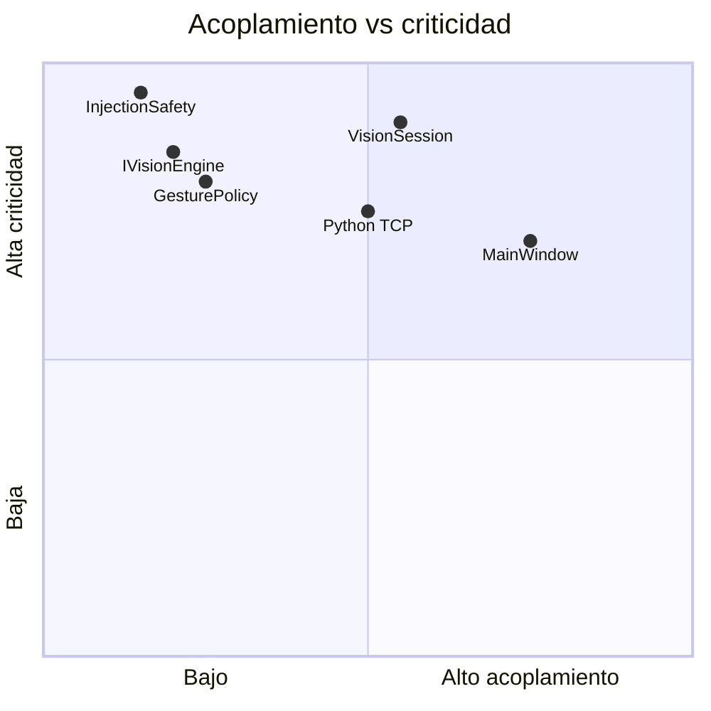

---

## 18. Referencias

| Documento | Uso |
|-----------|-----|
| [`README.md`](../../README.md) | Build, run, variables completas, OBS, logs |
| [`ARQUITECTURA.md`](ARQUITECTURA.md) | Detalle técnico ampliado (mismo diagramas, inventario) |
| [`VISION_E_IDEAS.md`](../../VISION_E_IDEAS.md) | Roadmap, ideas, contratos completos, UML extendido |
| [`MVP_CHECKLIST.md`](../../MVP_CHECKLIST.md) | Checklist e issues |
| [`CHANGELOG.md`](../CHANGELOG.md) | Historial por versión |
| [`notas-hardware.md`](notas-hardware.md) | Plantilla pruebas M5 |
| [`PyHands/Context.md`](../../PyHands/Context.md) | Contexto biblioteca Python |
| [`src/VibeWindows/Models/README.md`](../src/VibeWindows/Models/README.md) | Modelos ONNX |

---

## Mantenimiento de este documento

Actualizar **este archivo** cuando cambien:

- Versión en `WUI/VERSION` y hitos de producto.
- Contratos wire (`HandFrameDto`, `schema_version`).
- Requisitos RF/RNF cerrados o nuevos.
- Diagramas por nuevo motor, subsistema o fase.

*Documento unificado generado para revisión arquitectónica y onboarding. Es la referencia primaria del proyecto; los demás `.md` son complementos o histórico.*
